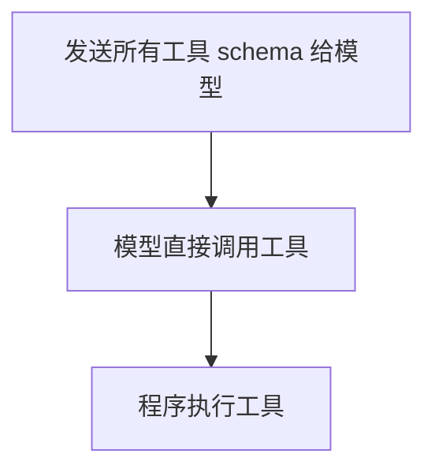
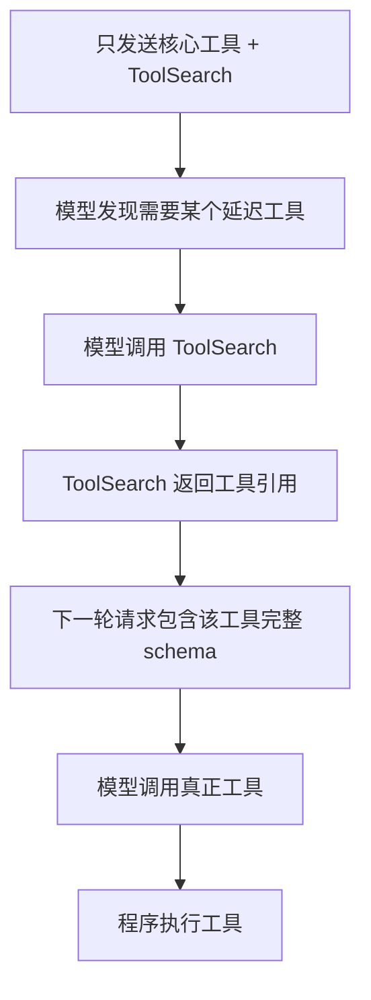

# 第 24 章：ToolSearch，工具太多时如何延迟加载 schema

前面几章我们已经把工具系统讲到了比较完整的程度：工具有名字，有描述，有输入 schema，有权限判断，有并发属性，有结果预算，也能通过 MCP 接入外部服务。

但是一旦工具数量变多，新的问题会出现。

假设你的 Agent 同时接入了：

- 文件系统工具。
- Shell 工具。
- GitHub MCP 工具。
- Slack MCP 工具。
- 浏览器 MCP 工具。
- 数据库 MCP 工具。
- Jira、Linear、Notion、Figma、Postgres、Kubernetes 等一堆外部工具。

每个工具都要向模型发送：

- 工具名。
- 工具描述。
- 输入 JSON Schema。
- 参数说明。
- 使用约束。

如果工具只有 10 个，问题不大。  
如果工具有 100 个，提示词会变得巨大。  
如果工具有 500 个，光工具定义就可能吃掉很大一部分上下文窗口。

更糟糕的是，大多数任务根本不需要所有工具。

用户说：

```text
帮我看一下这个项目为什么测试失败。
```

模型一般需要 Read、Grep、Bash、Edit、TodoWrite，也许需要 Git。它不需要 Slack，不需要 Chrome，不需要 Figma，不需要所有 MCP server 暴露出来的每一个工具。

用户说：

```text
把这个 PR 发到 Slack。
```

模型才需要 Slack 相关工具。

所以，一个成熟 Agent 不能简单地把所有工具一次性塞给模型。它需要一种机制：

```text
先只告诉模型“有哪些工具可能存在”，等模型真的需要某个工具时，再加载完整 schema。
```

这就是 ToolSearch 要解决的问题。

Claude Code 源码里有一个真实的 `ToolSearchTool`。它不是为了让用户搜索工具，而是为了让模型自己搜索工具。模型先调用 ToolSearch，拿到被选中工具的完整定义，然后下一步再调用真正的工具。

这一章我们就把这个机制拆开。

## 24.1 没有 ToolSearch 时会发生什么

先看一个没有 ToolSearch 的 Agent。

每次请求模型时，它都会构造一份工具列表：

```python
response = await model.messages.create(:
    "model": "claude-sonnet"
    messages
    "tools": [
    readToolSchema
    writeToolSchema
    editToolSchema
    bashToolSchema
    githubCreateIssueSchema
    githubListPrSchema
    githubMergePrSchema
    slackSendMessageSchema
    slackListChannelsSchema
    postgresQuerySchema
    // ... more and more tools
```

这在概念上很直观：

```text
模型看到所有工具。
模型选择一个工具。
程序执行工具。
```

但它有几个工程问题。

第一个问题是上下文浪费。

工具 schema 很长。一个复杂工具可能有很多参数、枚举、嵌套对象、字段说明。几十个复杂工具叠加起来，可能比用户真正的问题还长。

第二个问题是提示词污染。

模型看到太多工具后，选择空间变大。它可能会被不相关工具干扰。例如，只是读文件时却想着调用某个外部搜索工具。

第三个问题是 prompt cache 不稳定。

如果 MCP server 动态连接，工具列表会变化。工具列表一变化，请求的工具 schema 部分就变化，缓存命中率下降。

第四个问题是 API 或网关兼容。

有些模型或代理网关对工具 schema 大小、beta 字段、tool reference 能力支持不一样。工具越多，越容易撞到限制。

第五个问题是权限和可见性。

某些工具即使存在，也不一定应该在当前上下文里暴露给模型。你不希望模型看到一个它根本不能调用的工具，然后反复尝试。

ToolSearch 不是锦上添花，而是工具规模化之后的必需组件。

## 24.2 ToolSearch 的基本思想

ToolSearch 的思想可以用一句话概括：

```text
把“工具发现”和“工具调用”拆成两步。
```

没有 ToolSearch：



有 ToolSearch：



注意，这里不是把工具完全藏起来。

模型仍然需要知道：

- 有一些工具可以按需加载。
- 如何搜索这些工具。
- 搜索结果会让工具变成可调用状态。

所以 ToolSearch 本身必须是一个始终可见的核心工具。

Claude Code 的 `ToolSearchTool` 描述里说得很直接：它会获取延迟工具的完整 schema，让这些工具之后可以被调用。

这给我们一个重要设计原则：

```text
延迟加载机制本身不能延迟加载。
```

如果 ToolSearch 自己也被延迟了，模型就没有入口加载其他工具。

## 24.3 Claude Code 里的相关源码位置

这一章主要关联这些源码文件：

```text
src/tool.py
src/tools.py
src/mini_agent/tools/ToolSearchTool/ToolSearchtool.py
src/mini_agent/tools/ToolSearchTool/prompt.py
src/mini_agent/utils/toolSearch.py
src/services/api/claude.py
src/services/tools/toolExecution.py
```

这些文件分别负责不同层次：

```text
tool.py
  定义工具对象上的 shouldDefer、alwaysLoad、searchHint 等字段。

tools.py
  把 ToolSearchTool 加入基础工具池。

ToolSearchtool.py
  实现 ToolSearch 的输入、搜索逻辑、select 逻辑、输出映射。

prompt.py
  定义 ToolSearch 的工具说明，以及判断一个工具是否应该被延迟。

utils/toolSearch.py
  判断 ToolSearch 是否启用，提取历史消息里已经发现的工具，计算延迟工具增量。

services/api/claude.py
  真正发 API 请求前过滤工具列表，只发送核心工具和已经发现的延迟工具。

services/tools/toolExecution.py
  当模型误调用未加载 schema 的工具时，给出更有指导性的错误提示。
```

这是一种典型的成熟工程结构。

它没有把所有逻辑塞进 `ToolSearchTool` 一个文件里，而是分层：

- 工具对象知道自己是否可延迟。
- 工具池负责包含 ToolSearch。
- API 请求层负责决定本轮到底发送哪些 schema。
- 消息历史扫描负责记住哪些工具已被发现。
- 工具执行层负责处理错误恢复。

新手实现时可以先做一个简化版，但要理解生产版为什么会拆成这样。

## 24.4 Tool 上新增的几个字段

在 Claude Code 的 `Tool` 类型里，有几个字段专门和 ToolSearch 相关。

第一是 `searchHint`。

它是一个短短的能力提示，用于搜索匹配。

比如一个 `NotebookEdit` 工具，工具名里未必有 `jupyter`，但用户或模型可能会搜索 `jupyter`。这时 `searchHint` 就能补充关键词。

可以理解为：

```text
tool.name 是正式名字。
tool.description 是完整说明。
tool.searchHint 是给搜索系统看的短关键词。
```

第二是 `shouldDefer`。

它表示这个工具可以延迟加载。

```python
from typing import Any

def example(context: dict[str, Any]) -> dict[str, Any]:
    return {"ok": True, "context": context}
```

第三是 `alwaysLoad`。

它表示这个工具即使符合延迟条件，也必须在第一轮就完整加载。

```python
from typing import Any

def example(context: dict[str, Any]) -> dict[str, Any]:
    return {"ok": True, "context": context}
```

为什么需要 `alwaysLoad`？

因为不是所有工具都适合延迟。

例如：

- ToolSearch 自己不能延迟。
- 某些核心协作工具必须第一轮可见。
- 某些通信工具需要在模型一开始就理解其约束。
- 某些 SDK 场景要求工具开局可用。

第四是 `isMcp` 和 `mcpInfo`。

MCP 工具通常是延迟加载的重点，因为 MCP 一接入就可能带来大量外部工具。

源码中的判断逻辑大致是：

```text
如果 alwaysLoad 为 true，不延迟。
如果是 MCP 工具，默认延迟。
如果工具名是 ToolSearch，不延迟。
如果特定实验要求某工具第一轮可见，不延迟。
否则看 shouldDefer。
```

这给我们一个很重要的设计经验：

```text
延迟加载不是一个简单 boolean，而是一组优先级规则。
```

你不能只写：

```python
return tool.shouldDefer
```

因为这样会把一些关键工具错误地藏起来。

## 24.5 教学版：扩展 Tool 类型

我们先给 mini-agent 的 Tool 类型增加几个字段。

```python
from pathlib import Path

def resolve_inside_workspace(workspace: Path, user_path: str) -> Path:
    root = workspace.resolve()
    target = (root / user_path).resolve()
    if root != target and root not in target.parents:
        raise ValueError(f"Path is outside current workspace: {user_path}")
    return target

def read_text_file(workspace: Path, user_path: str) -> str:
    return resolve_inside_workspace(workspace, user_path).read_text(encoding="utf-8")
```

然后实现一个判断函数：

```python
def isDeferredTool(tool: Tool):
    if (tool.alwaysLoad) return False
    if (tool.name == "ToolSearch") return False
    if (tool.isMcp) return True
    return tool.shouldDefer == True
```

这个版本很简单，但它已经保留了核心思想：

- 明确排除永远加载工具。
- 明确排除 ToolSearch。
- 默认延迟 MCP 工具。
- 允许普通工具主动标记延迟。

这比在发送 API 请求时临时判断要清晰很多。

## 24.6 ToolSearch 的输入 schema

Claude Code 的 ToolSearch 输入很小：

```text
query: string
max_results?: number
```

其中 `query` 支持两种用法。

第一种是精确选择：

```text
select:mcp__slack__send_message
```

或者一次选择多个：

```text
select:mcp__slack__send_message,mcp__github__create_issue
```

第二种是关键词搜索：

```text
slack send
```

或者带 required term：

```text
+slack send
```

这里的 `+slack` 表示必须匹配 `slack`，然后再根据 `send` 排序。

为什么需要 `select:`？

因为有时候模型已经知道准确工具名。比如系统提示或延迟工具列表里出现了：

```text
mcp__slack__send_message
```

那模型不需要模糊搜索，它只要说：

```text
select:mcp__slack__send_message
```

这样可以减少误匹配。

教学版 schema 可以这样写：

```python
from typing import Any, Protocol

toolSearchInputSchema =:
    "query": str.describe(
    'Search deferred tools. Use "select:<tool_name>" for exact selection.'
    )
    "max_results": int | None.default(5)
```

输出可以先保持简单：

```python
from typing import Any

def example(context: dict[str, Any]) -> dict[str, Any]:
    return {"ok": True, "context": context}
```

生产版输出还会包含 pending MCP server 等信息。

## 24.7 工具搜索不是给人看的搜索框

新手容易误解 ToolSearch：以为它像命令面板，给用户输入关键词。

不是。

ToolSearch 的主要调用者是模型。

模型在思考时发现：

```text
我需要发 Slack，但当前可用工具里没有 Slack 发送工具。
```

于是它调用：

```json
{
  "query": "slack send",
  "max_results": 5
}
```

或者：

```json
{
  "query": "select:mcp__slack__send_message"
}
```

ToolSearch 返回匹配工具后，下一轮模型才能调用真正工具。

这意味着 ToolSearch 的提示词必须写给模型看，而不是写给用户看。它要明确告诉模型：

- 延迟工具当前只有名字可见。
- 不能直接调用还没加载 schema 的工具。
- 想调用某工具前，先用 `select:<tool_name>`。
- 关键词搜索可以用于不知道准确名称时。

Claude Code 的 prompt 就强调了：工具被 fetch 之前，只有名字已知，没有参数 schema，所以不能调用。

这句话非常重要。

如果模型没有完整 schema，它可能会猜参数。猜参数会导致：

- 数字被写成字符串。
- 数组被写成逗号分隔字符串。
- 枚举值拼错。
- 对象结构不符合要求。

所以 ToolSearch 不是为了“知道工具存在”，而是为了“拿到参数合同”。

## 24.8 select 模式的实现

先实现最简单的 `select:`。

```python
from typing import Any

def example(context: dict[str, Any]) -> dict[str, Any]:
    return {"ok": True, "context": context}
```

然后在 ToolSearch 里处理：

```python
from pathlib import Path

def resolve_inside_workspace(workspace: Path, user_path: str) -> Path:
    root = workspace.resolve()
    target = (root / user_path).resolve()
    if root != target and root not in target.parents:
        raise ValueError(f"Path is outside current workspace: {user_path}")
    return target

def read_text_file(workspace: Path, user_path: str) -> str:
    return resolve_inside_workspace(workspace, user_path).read_text(encoding="utf-8")
```

注意这里我们从 `allTools` 里找，而不只是从 `deferredTools` 里找。

为什么？

如果模型选择了一个已经加载的工具，返回它没有坏处。Claude Code 源码里也有类似容错：如果工具不在 deferred set 里但存在于完整工具池里，也可以返回。

这可以减少模型陷入重试。

例如模型调用：

```text
select:Read
```

Read 本来已经加载了。你可以告诉它：

```text
Read
```

这相当于 no-op，但不会让模型困惑。

## 24.9 关键词搜索：先做可解释，不要一上来做向量检索

ToolSearch 可以用很多搜索算法：

- 关键词匹配。
- BM25。
- 向量检索。
- 混合检索。
- 由另一个模型重排。

但对新手来说，第一版建议先做关键词搜索。

原因很简单：

```text
工具名和工具描述通常已经高度结构化，关键词搜索足够解释问题。
```

如果搜索不到，你能很快知道是：

- 工具名不包含关键词。
- 描述写得不好。
- searchHint 缺失。
- 查询词和描述词不一致。

向量检索虽然高级，但第一版出了问题更难调试。

我们可以设计一个简单评分：

```text
工具名完整匹配：高分
工具名部分匹配：中分
searchHint 匹配：中高分
description 匹配：低分
```

示例：

```python
from pathlib import Path

def resolve_inside_workspace(workspace: Path, user_path: str) -> Path:
    root = workspace.resolve()
    target = (root / user_path).resolve()
    if root != target and root not in target.parents:
        raise ValueError(f"Path is outside current workspace: {user_path}")
    return target

def read_text_file(workspace: Path, user_path: str) -> str:
    return resolve_inside_workspace(workspace, user_path).read_text(encoding="utf-8")
```

然后：

```python
from pathlib import Path

def resolve_inside_workspace(workspace: Path, user_path: str) -> Path:
    root = workspace.resolve()
    target = (root / user_path).resolve()
    if root != target and root not in target.parents:
        raise ValueError(f"Path is outside current workspace: {user_path}")
    return target

def read_text_file(workspace: Path, user_path: str) -> str:
    return resolve_inside_workspace(workspace, user_path).read_text(encoding="utf-8")
```

这已经能覆盖很多场景。

例如工具名：

```text
mcp__slack__send_message
mcp__slack__list_channels
mcp__github__create_issue
mcp__github__list_pull_requests
```

查询：

```text
slack send
```

会优先命中：

```text
mcp__slack__send_message
```

查询：

```text
github issue
```

会优先命中：

```text
mcp__github__create_issue
```

## 24.10 required terms：为什么需要 +slack

关键词搜索有一个细节：有时你希望某个词必须出现。

例如查询：

```text
slack send
```

如果某个 GitHub 工具描述里有 “send notification”，也许会被错误排到前面。

这时可以支持 required terms：

```text
+slack send
```

含义是：

```text
工具必须匹配 slack，然后再根据 send 排名。
```

教学版实现：

```python
from pathlib import Path

def resolve_inside_workspace(workspace: Path, user_path: str) -> Path:
    root = workspace.resolve()
    target = (root / user_path).resolve()
    if root != target and root not in target.parents:
        raise ValueError(f"Path is outside current workspace: {user_path}")
    return target

def read_text_file(workspace: Path, user_path: str) -> str:
    return resolve_inside_workspace(workspace, user_path).read_text(encoding="utf-8")
```

然后搜索：

```python
from pathlib import Path

def resolve_inside_workspace(workspace: Path, user_path: str) -> Path:
    root = workspace.resolve()
    target = (root / user_path).resolve()
    if root != target and root not in target.parents:
        raise ValueError(f"Path is outside current workspace: {user_path}")
    return target

def read_text_file(workspace: Path, user_path: str) -> str:
    return resolve_inside_workspace(workspace, user_path).read_text(encoding="utf-8")
```

这就是一个够用的第一版 ToolSearch。

## 24.11 ToolSearch 的输出不只是文本

新手可能会让 ToolSearch 返回一段文本：

```text
Found tools:
- mcp__slack__send_message
- mcp__slack__list_channels
```

这对人类可读，但对模型加载 schema 没有帮助。

真正关键的是：搜索结果必须触发下一轮 API 请求包含这些工具的完整 schema。

Claude Code 使用了 `tool_reference` 这种内容块。ToolSearch 的结果不是普通文字，而是类似：

```json
{
  "type": "tool_result",
  "tool_use_id": "...",
  "content": [
    {
      "type": "tool_reference",
      "tool_name": "mcp__slack__send_message"
    }
  ]
}
```

然后请求构造层扫描消息历史：

```text
历史里出现过 tool_reference: mcp__slack__send_message
```

于是下一轮把 `mcp__slack__send_message` 的完整工具 schema 放进工具列表。

教学版不一定有真实 API 的 `tool_reference` 能力，但你要模拟同样的状态变化。

可以这样设计：

```python
from dataclasses import dataclass, field
from datetime import datetime, timezone
from typing import Any

@dataclass
class Message:
    role: str
    content: list[dict[str, Any]] | str

@dataclass
class TranscriptEntry:
    kind: str
    session_id: str
    message: Message
    uuid: str
    parent_uuid: str | None = None
    created_at: str = field(default_factory=lambda: datetime.now(timezone.utc).isoformat())
```

然后提取已发现工具：

```python
from dataclasses import dataclass, field
from datetime import datetime, timezone
from typing import Any

@dataclass
class Message:
    role: str
    content: list[dict[str, Any]] | str

@dataclass
class TranscriptEntry:
    kind: str
    session_id: str
    message: Message
    uuid: str
    parent_uuid: str | None = None
    created_at: str = field(default_factory=lambda: datetime.now(timezone.utc).isoformat())
```

这一步是 ToolSearch 的核心。

搜索本身不难。真正重要的是：

```text
搜索结果如何改变下一轮发送给模型的工具集合。
```

## 24.12 构造本轮工具列表

现在我们来实现最关键的函数：

```python
from dataclasses import dataclass, field
from datetime import datetime, timezone
from typing import Any

@dataclass
class Message:
    role: str
    content: list[dict[str, Any]] | str

@dataclass
class TranscriptEntry:
    kind: str
    session_id: str
    message: Message
    uuid: str
    parent_uuid: str | None = None
    created_at: str = field(default_factory=lambda: datetime.now(timezone.utc).isoformat())
```

这段逻辑对应 Claude Code API 请求层的核心思路：

```text
非延迟工具：总是发送。
ToolSearch：总是发送。
延迟工具：只有被发现后才发送。
```

举个例子。

完整工具池：

```text
Read
Edit
Bash
ToolSearch
mcp__slack__send_message
mcp__github__create_issue
```

第 1 轮消息历史没有发现工具。

发送给模型的工具：

```text
Read
Edit
Bash
ToolSearch
```

模型调用：

```text
ToolSearch query="slack send"
```

ToolSearch 返回：

```text
tool_reference mcp__slack__send_message
```

第 2 轮发送给模型的工具：

```text
Read
Edit
Bash
ToolSearch
mcp__slack__send_message
```

模型现在能调用：

```text
mcp__slack__send_message
```

这就是完整闭环。

## 24.13 defer_loading 和工具引用

Claude Code 还会在工具 schema 里设置一个 `defer_loading` 字段。

这个字段的意思是：

```text
这个工具是延迟加载工具。API 需要配合 ToolSearch / tool_reference 机制处理它。
```

你可以把它理解成工具 schema 上的标记：

```json
{
  "name": "mcp__slack__send_message",
  "description": "...",
  "input_schema": {...},
  "defer_loading": true
}
```

这属于模型 API 的高级能力，不是每个模型或网关都支持。

所以 Claude Code 源码里有大量判断：

- 当前模式是否启用 ToolSearch。
- 当前模型是否支持 tool reference。
- 当前 API provider 是否支持相关 beta。
- 当前工具列表里是否有 ToolSearch。
- 是否有 pending MCP server。
- 是否启用了 kill switch。

新手第一版可以不实现 `defer_loading`，但要理解：

```text
如果底层 API 支持工具引用，就让 API 负责把 tool_reference 展开成工具 schema。
如果底层 API 不支持，就在客户端自己维护 discoveredTools，并在下一轮请求里显式加入工具 schema。
```

教学版建议走第二种，因为它更容易理解。

## 24.14 ToolSearchTool 必须是只读和并发安全的

ToolSearch 只是搜索工具定义，不改变项目文件，不执行外部副作用。

所以它应该是：

```text
readOnly = true
concurrencySafe = true
```

Claude Code 里 `ToolSearchTool` 的 `isReadOnly()` 返回 true，`isConcurrencySafe()` 也返回 true。

这很合理。

如果模型同时需要搜索 Slack 工具和 GitHub 工具，理论上这些 ToolSearch 调用可以并发。

但教学版可以先不并发，先保证语义正确。

## 24.15 ToolSearch 的错误恢复

一个成熟 Agent 不能假设模型永远按流程来。

模型可能会直接调用一个延迟工具：

```text
mcp__slack__send_message
```

但这个工具的 schema 还没有发送给模型。结果模型可能猜错参数：

```json
{
  "channel": "general",
  "text": ["hello"]
}
```

如果 schema 需要的是：

```json
{
  "channel_id": "C123",
  "message": "hello"
}
```

校验就会失败。

Claude Code 在工具执行层有一个很贴心的恢复逻辑：当 Zod 校验失败时，如果发现这个工具是延迟工具，而且历史里没有发现过它，就给模型追加一段提示：

```text
这个工具的 schema 没有发送给 API。
请先用 ToolSearch select:<tool_name> 加载它，然后重试。
```

这就是工程经验。

你不能只是说：

```text
Input validation failed.
```

因为模型不知道失败原因是 schema 没加载。它会继续乱猜参数。

教学版可以这样做：

```python
from dataclasses import dataclass, field
from datetime import datetime, timezone
from typing import Any

@dataclass
class Message:
    role: str
    content: list[dict[str, Any]] | str

@dataclass
class TranscriptEntry:
    kind: str
    session_id: str
    message: Message
    uuid: str
    parent_uuid: str | None = None
    created_at: str = field(default_factory=lambda: datetime.now(timezone.utc).isoformat())
```

在参数校验失败时：

```python
from typing import Any

def example(context: dict[str, Any]) -> dict[str, Any]:
    return {"ok": True, "context": context}
```

这会显著提升模型自我修复能力。

## 24.16 延迟工具列表怎么告诉模型

如果模型完全不知道有哪些延迟工具，它就没法搜索。

所以系统需要某种方式告诉模型：

```text
当前有这些延迟工具名字可搜索。
```

最简单做法是在每轮请求前插入一条元消息：

```text
<available-deferred-tools>
mcp__slack__send_message
mcp__slack__list_channels
mcp__github__create_issue
</available-deferred-tools>
```

这种方式容易实现，但会带来两个问题：

第一，工具列表每轮重复，占上下文。

第二，工具池变化时会影响 prompt cache。

Claude Code 有更细的做法：使用 deferred tools delta，也就是只告诉模型新增或移除的延迟工具。

概念上像这样：

```text
第 1 轮：
新增延迟工具：
- mcp__slack__send_message
- mcp__github__create_issue

第 5 轮：
新增延迟工具：
- mcp__jira__create_ticket

第 8 轮：
移除延迟工具：
- mcp__old_server__deprecated_tool
```

这样就不用每轮重复完整列表。

教学版可以先用完整列表。等你实现稳定后，再加 delta。

## 24.17 教学版：延迟工具列表消息

先实现简单版本：

```python
from dataclasses import dataclass, field
from datetime import datetime, timezone
from typing import Any

@dataclass
class Message:
    role: str
    content: list[dict[str, Any]] | str

@dataclass
class TranscriptEntry:
    kind: str
    session_id: str
    message: Message
    uuid: str
    parent_uuid: str | None = None
    created_at: str = field(default_factory=lambda: datetime.now(timezone.utc).isoformat())
```

请求模型前：

```python
deferredMessage = buildDeferredToolsMessage(allTools)

messagesForModel = deferredMessage
? [{ role: "user", content: deferredMessage, meta: True }, ...messages]
: messages
```

但要注意，模型还需要知道如何使用这些名字。这个说明应该放在 ToolSearch 的 description 或系统提示里：

```text
Deferred tools appear in <available-deferred-tools>.
Use ToolSearch with select:<tool_name> to load full schema before calling them.
```

如果只给工具名，不解释流程，模型仍然可能直接调用工具。

## 24.18 教学版：完整 ToolSearchTool

下面是一个可以放进 mini-agent 的简化实现。

```python
from pathlib import Path

def resolve_inside_workspace(workspace: Path, user_path: str) -> Path:
    root = workspace.resolve()
    target = (root / user_path).resolve()
    if root != target and root not in target.parents:
        raise ValueError(f"Path is outside current workspace: {user_path}")
    return target

def read_text_file(workspace: Path, user_path: str) -> str:
    return resolve_inside_workspace(workspace, user_path).read_text(encoding="utf-8")
```

真实系统里还要补：

- 日志。
- pending MCP server。
- 权限过滤。
- 工具名 alias。
- 搜索缓存。
- analytics。
- tool_reference 输出格式。

但第一版先把闭环跑通。

## 24.19 权限过滤必须发生在 ToolSearch 之前

有一个非常容易忽略的安全点：

```text
ToolSearch 只能搜索当前用户当前会话允许看到的工具。
```

如果用户 deny 了某个工具，你不能让 ToolSearch 搜出来。

否则会发生：

```text
执行时拒绝，但搜索时可见。
```

这会带来两个问题。

第一，模型会不断尝试使用被拒绝工具，浪费轮次。

第二，可见性本身就是信息泄露。某些工具名可能暴露系统能力、内部集成或敏感资源。

所以正确顺序应该是：

```text
完整工具池
  -> 根据权限过滤
  -> 根据启用状态过滤
  -> 得到当前可用工具池
  -> ToolSearch 只搜索这个工具池
```

Claude Code 的工具组装逻辑会先根据 deny rules 过滤工具，然后再参与工具池组装和 ToolSearch 判断。

教学版也应该这样：

```python
from dataclasses import dataclass
from typing import Literal

Decision = Literal["allow", "deny", "ask"]

@dataclass
class PermissionRule:
    source: str
    behavior: Decision
    tool_name: str
    rule_content: str = ""

def format_rule(rule: PermissionRule) -> str:
    content = f"({rule.rule_content})" if rule.rule_content else ""
    return f"{rule.source}:{rule.behavior}:{rule.tool_name}{content}"

def deny_message(rule: PermissionRule) -> dict[str, str]:
    return {
        "behavior": "deny",
        "message": f"Denied by {format_rule(rule)}",
        "reason": "Matched deny rule",
    }
```

不要让 ToolSearch 拿原始 `allTools` 搜。

## 24.20 searchHint 怎么写

`searchHint` 看起来是小字段，但对 ToolSearch 质量影响很大。

好的 searchHint 应该：

- 短。
- 包含用户和模型可能搜索的同义词。
- 不重复工具名里已经有的词。
- 不写完整说明。
- 不写营销话术。

例子：

```python
NotebookEditTool =:
    "name": "NotebookEdit"
    "searchHint": "jupyter cells ipynb"
```

Slack 发送消息：

```python

    "name": "mcp__slack__send_message"
    "searchHint": "chat channel post notify"
```

GitHub PR 工具：

```python

    "name": "mcp__github__list_pull_requests"
    "searchHint": "pr review branch merge"
```

不好的写法：

```python
"searchHint": "This tool is a very useful tool that helps you do many things"
```

这对搜索几乎没有帮助。

也不要写太长。太长会让搜索噪声变大。

## 24.21 ToolSearch 和上下文压缩

上下文压缩会带来一个特殊问题。

假设前面某轮 ToolSearch 已经加载了：

```text
mcp__slack__send_message
```

后来会话太长，系统进行 compact，把旧消息压缩成摘要。

如果 ToolSearch 的 `tool_reference` 消息被压掉，下一轮系统扫描历史时就找不到：

```text
mcp__slack__send_message
```

于是这个工具会从已加载工具里消失。

模型可能上一轮还能调用 Slack，下一轮突然不能调用。

Claude Code 为这个问题做了处理：压缩边界会保存 pre-compact discovered tools，之后扫描历史时还能把这些工具恢复回来。

教学版也要理解这个风险。

如果你做了会话压缩，需要在 compact metadata 里保存：

```python
from typing import Any

def example(context: dict[str, Any]) -> dict[str, Any]:
    return {"ok": True, "context": context}
```

压缩前：

```python
discoveredTools = [...extractDiscoveredToolNames(messages)]
```

压缩后插入边界消息：

```python

    "role": "system"
    "type": "compact_boundary"
    "metadata"::
        discoveredTools
```

提取时：

```python
from dataclasses import dataclass, field
from datetime import datetime, timezone
from typing import Any

@dataclass
class Message:
    role: str
    content: list[dict[str, Any]] | str

@dataclass
class TranscriptEntry:
    kind: str
    session_id: str
    message: Message
    uuid: str
    parent_uuid: str | None = None
    created_at: str = field(default_factory=lambda: datetime.now(timezone.utc).isoformat())
```

这是一个典型的“状态不能只藏在被压缩消息里”的问题。

## 24.22 ToolSearch 的启用策略

是不是所有时候都要启用 ToolSearch？

不一定。

Claude Code 支持几种模式：

```text
standard
  不启用 ToolSearch，所有工具直接发送。

tst
  启用 ToolSearch，延迟工具按需加载。

tst-auto
  自动判断：当延迟工具定义超过上下文阈值时才启用。
```

为什么需要 auto？

如果只有两个 MCP 工具，直接发送也许更简单。ToolSearch 会多一次 round-trip，反而拖慢任务。

如果有一百个 MCP 工具，ToolSearch 就很划算。

所以可以用一个阈值：

```text
延迟工具 schema 总 token 数 >= 上下文窗口的 10%
```

就启用 ToolSearch。

教学版可以先用工具数量阈值：

```python
from typing import Any

def example(context: dict[str, Any]) -> dict[str, Any]:
    return {"ok": True, "context": context}
```

更进一步可以估算字符数：

```python
from pathlib import Path

def resolve_inside_workspace(workspace: Path, user_path: str) -> Path:
    root = workspace.resolve()
    target = (root / user_path).resolve()
    if root != target and root not in target.parents:
        raise ValueError(f"Path is outside current workspace: {user_path}")
    return target

def read_text_file(workspace: Path, user_path: str) -> str:
    return resolve_inside_workspace(workspace, user_path).read_text(encoding="utf-8")
```

新手第一版可以手动开关：

```bash
ENABLE_TOOL_SEARCH=true
```

等系统稳定后再做 auto。

## 24.23 pending MCP server 的处理

MCP server 可能还在连接。

此时 ToolSearch 搜不到某个工具，不一定代表工具不存在，可能只是 server 还没连上。

Claude Code 的 ToolSearch 输出里有一个 `pending_mcp_servers` 字段。搜索无结果时，如果有 server 正在连接，它会告诉模型：

```text
Some MCP servers are still connecting. Try again shortly.
```

教学版可以设计：

```python
from typing import Any

def example(context: dict[str, Any]) -> dict[str, Any]:
    return {"ok": True, "context": context}
```

ToolSearch 搜不到时：

```python
from pathlib import Path

def resolve_inside_workspace(workspace: Path, user_path: str) -> Path:
    root = workspace.resolve()
    target = (root / user_path).resolve()
    if root != target and root not in target.parents:
        raise ValueError(f"Path is outside current workspace: {user_path}")
    return target

def read_text_file(workspace: Path, user_path: str) -> str:
    return resolve_inside_workspace(workspace, user_path).read_text(encoding="utf-8")
```

这能避免模型马上断定：

```text
没有 Slack 工具。
```

而是知道：

```text
Slack server 可能还在连接，等一下再搜。
```

## 24.24 ToolSearch 不是安全边界

ToolSearch 可以减少工具暴露，但它不是安全边界。

安全边界仍然是：

- 权限系统。
- 沙箱。
- 工具执行前的 canUseTool。
- 命令解析。
- 人类确认。
- 审计日志。

不要以为延迟工具没出现在当前工具列表里，就一定无法被滥用。

模型可以请求加载它。  
用户可以改变任务。  
MCP server 可以动态出现。  
历史消息可能携带已发现工具。  
压缩 metadata 可能恢复已发现工具。

所以每一次真正执行工具时，都必须重新过权限。

正确姿势是：

```text
ToolSearch 控制可见性和上下文成本。
Permission 控制是否允许执行。
Sandbox 控制执行后的破坏范围。
```

这三者不能互相替代。

## 24.25 ToolSearch 的测试清单

ToolSearch 很容易出现“看起来能用，但边界坏掉”的问题。你至少要写这些测试。

测试一：非延迟工具永远出现在请求工具列表里。

```text
Read、Edit、Bash、ToolSearch 应该可见。
```

测试二：延迟工具默认不出现在请求工具列表里。

```text
mcp__slack__send_message 第一轮不应该带完整 schema。
```

测试三：ToolSearch select 后，下一轮出现该工具。

```text
ToolSearch -> tool_reference -> buildToolsForRequest includes selected tool。
```

测试四：关键词搜索能找到正确工具。

```text
"slack send" -> mcp__slack__send_message
```

测试五：required term 生效。

```text
"+slack send" 不应该返回 github send notification。
```

测试六：deny 工具不可搜索。

```text
权限禁止 mcp__slack__send_message 后，ToolSearch 不返回它。
```

测试七：压缩后 discovered tools 不丢失。

```text
compact boundary metadata 能恢复已发现工具。
```

测试八：未加载 schema 的工具校验失败时，错误里包含 ToolSearch 提示。

```text
Call ToolSearch with select:<tool_name> first。
```

测试九：pending MCP server 搜索无结果时有提示。

测试十：ToolSearch 自己永不延迟。

这些测试覆盖了 ToolSearch 的核心语义。

## 24.26 常见错误

错误一：只隐藏工具 schema，不告诉模型有哪些延迟工具。

结果：模型不知道该搜什么。

错误二：ToolSearch 只返回文本，不改变后续工具列表。

结果：模型看到名字，但还是不能调用工具。

错误三：把 ToolSearch 自己延迟。

结果：模型没有入口加载延迟工具。

错误四：权限过滤发生在 ToolSearch 之后。

结果：模型能搜索到不该看见的工具。

错误五：上下文压缩丢失已发现工具。

结果：工具在长会话中突然消失。

错误六：所有 MCP 工具都延迟，没有 alwaysLoad 例外。

结果：某些必须第一轮可用的工具不可用。

错误七：搜索算法太复杂，缺少可调试性。

结果：搜不到工具时不知道为什么。

错误八：模型不支持 tool_reference，仍然发送相关字段。

结果：API 报 400，任务中断。

错误九：延迟加载被当成安全机制。

结果：执行层缺少真正权限保护。

## 24.27 从 Claude Code 学到的工程原则

Claude Code 的 ToolSearch 体现了几个成熟原则。

第一，工具系统要有规模意识。

只支持十几个内置工具时，简单工具列表够用。支持大量 MCP 工具后，必须延迟加载。

第二，工具发现和工具执行要分离。

发现工具不代表允许执行工具。ToolSearch 是发现层，权限系统是执行层。

第三，模型需要明确的恢复路径。

当 schema 未加载导致参数错误时，要告诉模型用 ToolSearch 加载，而不是只返回校验失败。

第四，状态要能跨压缩保留。

已发现工具是会话状态的一部分，不能因为 compact 丢失。

第五，启用策略要考虑模型和 provider。

不是所有模型都支持同样的工具引用能力。高级能力必须有 fallback 和 kill switch。

第六，提示词和实现必须一致。

如果 ToolSearch prompt 告诉模型延迟工具在某个位置出现，实际请求构造层就必须真的在那里放置延迟工具信息。

## 24.28 本章练习

练习一：给 mini-agent 的 Tool 类型增加：

- searchHint
- shouldDefer
- alwaysLoad
- isMcp

练习二：实现 `isDeferredTool(tool)`。

要求：

- alwaysLoad 优先。
- ToolSearch 永不延迟。
- MCP 默认延迟。
- shouldDefer 为 true 时延迟。

练习三：实现 `ToolSearch` 工具。

支持：

- `select:<tool_name>`
- 关键词搜索
- `max_results`

练习四：实现 `extractDiscoveredToolNames(messages)`。

从 ToolSearch 结果里提取已发现工具。

练习五：实现 `buildToolsForRequest(allTools, messages)`。

只发送：

- 非延迟工具。
- ToolSearch。
- 已发现延迟工具。

练习六：给参数校验失败增加 schema not loaded hint。

练习七：设计一个测试，证明 deny 的工具不会被 ToolSearch 搜到。

练习八：思考题：

```text
如果用户说“帮我发 Slack”，但 Slack MCP server 还在连接，Agent 应该怎么表达状态？
```

练习九：扩展搜索算法，让 `+slack send` 必须匹配 slack。

练习十：实现一个 compact boundary，保存已发现工具。

## 24.29 本章小结

本章我们讲了 ToolSearch。

你应该已经理解：

1. 工具太多时，不能把所有 schema 都塞进上下文。
2. ToolSearch 把工具发现和工具调用拆成两步。
3. 延迟工具第一轮只暴露名字，不暴露完整参数 schema。
4. 模型调用 ToolSearch 后，系统要在下一轮加入被发现工具的完整 schema。
5. `select:<tool_name>` 是精确加载工具的关键路径。
6. 关键词搜索第一版可以用可解释的简单评分。
7. ToolSearch 结果必须改变后续工具列表，而不能只是文本。
8. 权限过滤要发生在 ToolSearch 之前。
9. 上下文压缩不能丢掉已发现工具。
10. ToolSearch 不是安全边界，真正执行仍然要权限和沙箱。

到这里，第 3 卷的工具系统已经非常完整：我们从 Tool schema、工具生命周期、并发调度、结果预算、Bash 安全、MCP 包装，一路讲到 ToolSearch。

下一章开始，我们进入第 4 卷：权限、安全与沙箱。Agent 终于有了很多能力，但能力越多，越需要边界。
