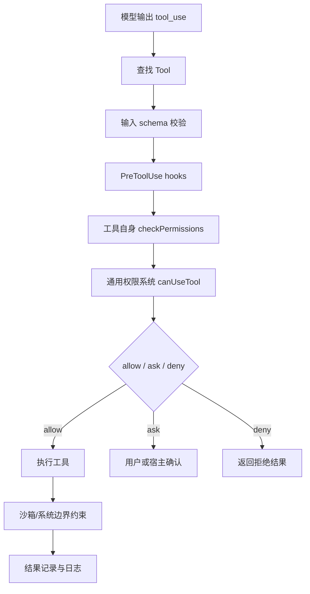
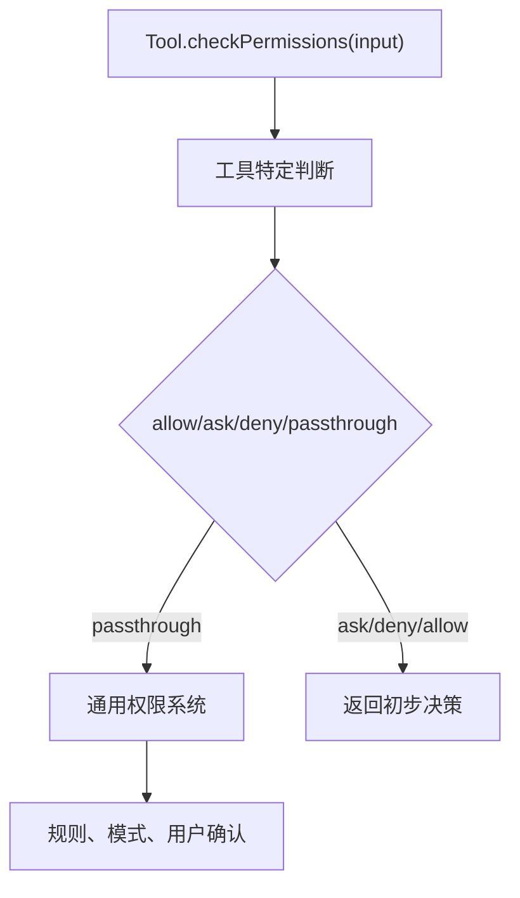

# 第 25 章：权限、安全与沙箱总览

到上一章为止，我们已经给 Agent 装上了很多能力：

- 它能读文件。
- 它能搜索项目。
- 它能执行 shell 命令。
- 它能写文件、改文件。
- 它能调用 MCP 外部工具。
- 它能通过 ToolSearch 按需加载更多工具。

这时 Agent 已经不再只是“会聊天的模型”。它是一个可以对真实环境产生影响的程序。

也正因为如此，从这一章开始，我们进入全书最重要的工程主题之一：

```text
安全。
```

这里的安全不是一句空泛的口号。对 AI Agent 来说，安全至少包含四层含义：

1. 模型能不能看到某个工具。
2. 模型能不能请求调用某个工具。
3. 程序能不能批准这次调用。
4. 即使批准了，执行环境能不能限制破坏范围。

很多新手会把 Agent 安全理解成一句系统提示：

```text
你不能做危险操作。
```

这远远不够。

提示词可以引导模型，但不能作为安全边界。真正的安全必须由代码实现，由权限系统执行，由沙箱兜底，由日志审计。

这一章先建立总图。后面几章会逐层深入。

## 25.1 为什么 Agent 安全比普通程序更复杂

普通程序的行为通常由开发者写死。

例如一个命令行工具：

```bash
mytool format src/index.py
```

它做什么基本由代码决定。

Agent 不一样。

Agent 的行为由三部分共同决定：

- 用户输入。
- 模型推理。
- 工具执行。

用户可能说得模糊：

```text
帮我清理一下项目。
```

模型可能理解成：

```text
删除临时文件、删除构建产物、删除未跟踪文件。
```

但“清理项目”也可能误伤：

```bash
rm -rf .
git clean -xfd
```

这就是 Agent 的风险：它会把自然语言目标转成可执行动作，而中间有推理和解释空间。

所以 Agent 安全必须回答：

```text
模型想做一件事时，程序如何判断它是否可以做？
```

这比普通程序复杂很多。

## 25.2 不能把安全交给模型自觉

模型可以很聪明，但它不是安全边界。

原因有几个。

第一，模型会犯错。

它可能误判命令影响范围，误解用户意图，或没有注意到路径是敏感文件。

第二，模型会被上下文影响。

项目里的 README、issue、网页、日志、文件内容，都可能包含诱导性文本。模型读到这些文本后，可能被“指挥”去执行某些操作。

第三，模型无法真正限制操作。

即使模型“知道”不要删除文件，如果程序把 `rm -rf` 原样交给 shell，真正执行时没有任何保护。

第四，模型的输出只是建议。

工具调用必须由宿主程序执行。既然宿主程序才是真正执行者，宿主程序就必须负责权限判断。

所以正确原则是：

```text
模型可以提出动作，程序必须裁决动作。
```

也可以说：

```text
LLM proposes, runtime disposes.
```

在本书里，我们会把这句话落实成代码。

## 25.3 Claude Code 的安全链路

从源码看，Claude Code 的安全链路大致是：



实际源码会更复杂，因为它还支持：

- 非交互模式。
- 后台 agent。
- swarm worker。
- hooks。
- 自动分类器。
- SDK host 的权限回调。
- MCP 工具。
- Bash 安全解析。
- 文件系统路径规则。

但主线就是这条。

注意顺序：

```text
先校验输入，再权限判断，再执行工具。
```

不要先执行再判断。

## 25.4 四层安全模型

为了让新手容易理解，我们先把 Agent 安全拆成四层。

第一层：工具可见性。

模型是否能看到某个工具？  
ToolSearch、deny rules、MCP server 过滤都属于这一层。

第二层：权限决策。

模型请求调用工具后，程序是否允许？  
allow、ask、deny、permission mode、路径规则都属于这一层。

第三层：执行隔离。

即使允许执行，执行环境能否限制它？  
沙箱、cwd 限制、网络限制、文件系统 write allowlist 都属于这一层。

第四层：审计和恢复。

执行后能否记录、解释、回滚或让用户理解发生了什么？  
日志、tool result、diff、permission decision reason、任务记录都属于这一层。

这四层不是互相替代的。

```text
可见性减少误用。
权限系统决定能不能做。
沙箱限制做坏了的范围。
审计让人知道发生了什么。
```

一个成熟 Agent 必须四层都考虑。

## 25.5 ToolPermissionContext 是权限系统的核心状态

在 Claude Code 里，`ToolPermissionContext` 记录了当前会话的权限状态。它大致包含：

- 当前 permission mode。
- 额外工作目录。
- always allow 规则。
- always deny 规则。
- always ask 规则。
- 是否允许 bypass permissions。
- 是否应该避免弹出权限提示。
- 是否等待自动检查再显示确认框。

我们可以把它理解成：

```text
当前会话的权限配置快照。
```

教学版可以先设计成：

```python
from dataclasses import dataclass
from typing import Literal

Decision = Literal["allow", "deny", "ask"]

@dataclass
class PermissionRule:
    source: str
    behavior: Decision
    tool_name: str
    rule_content: str = ""

def format_rule(rule: PermissionRule) -> str:
    content = f"({rule.rule_content})" if rule.rule_content else ""
    return f"{rule.source}:{rule.behavior}:{rule.tool_name}{content}"

def deny_message(rule: PermissionRule) -> dict[str, str]:
    return {
        "behavior": "deny",
        "message": f"Denied by {format_rule(rule)}",
        "reason": "Matched deny rule",
    }
```

这已经能表达很多东西。

例如：

```python
from dataclasses import dataclass
from typing import Any, Literal

Decision = Literal["allow", "deny", "ask"]

@dataclass
class PermissionDecision:
    decision: Decision
    reason: str = ""
    rule: str | None = None

def check_tool_permission(tool_name: str, tool_input: dict[str, Any]) -> PermissionDecision:
    command = str(tool_input.get("command", ""))
    if tool_name == "Bash" and command.startswith("rm -rf"):
        return PermissionDecision("deny", "危险删除命令", "Bash(rm -rf*)")
    if tool_name in {"Read", "Grep"}:
        return PermissionDecision("allow")
    return PermissionDecision("ask", f"需要用户确认: {tool_name}")
```

真实系统会把规则按来源和行为分开存储，便于加载、覆盖、持久化和解释。教学版可以先用一个数组。

## 25.6 PermissionResult：不要只返回 boolean

很多新手会写：

```python
async def canUseTool(tool, input):
    return True
```

这太弱了。

权限决策不应该只是 true 或 false。

它至少需要三种结果：

```text
allow：允许执行。
ask：需要问用户。
deny：拒绝执行。
```

还需要解释原因：

```text
为什么允许？
为什么拒绝？
如果需要询问，询问时给用户看什么？
是否有推荐的“总是允许”规则？
是否需要修改输入？
```

Claude Code 的 `PermissionResult` 类型就不是 boolean，而是一组结构化结果：

- `allow`
- `ask`
- `deny`
- `passthrough`

教学版可以这样设计：

```python
from dataclasses import dataclass
from typing import Literal

Decision = Literal["allow", "deny", "ask"]

@dataclass
class PermissionRule:
    source: str
    behavior: Decision
    tool_name: str
    rule_content: str = ""

def format_rule(rule: PermissionRule) -> str:
    content = f"({rule.rule_content})" if rule.rule_content else ""
    return f"{rule.source}:{rule.behavior}:{rule.tool_name}{content}"

def deny_message(rule: PermissionRule) -> dict[str, str]:
    return {
        "behavior": "deny",
        "message": f"Denied by {format_rule(rule)}",
        "reason": "Matched deny rule",
    }
```

为什么需要 `updatedInput`？

有时权限系统会规范化输入。

例如 Edit 工具可能把路径解析成绝对路径，或者用户确认后选择了一个更安全的替代参数。

为什么需要 `suggestions`？

用户点击“总是允许类似操作”时，程序需要知道该添加什么规则。

例如：

```text
允许本会话读 /project/src/**
```

或者：

```text
允许本项目运行 pytest
```

如果没有结构化建议，就只能把自然语言硬塞进配置，后续很难维护。

## 25.7 权限模式：同一工具在不同模式下结果不同

Claude Code 里有多种 permission mode。我们不需要一开始完全复刻，但要理解它们背后的工程需求。

常见模式可以这样理解：

```text
default
  默认模式。读操作通常更宽松，写操作和危险命令需要确认。

acceptEdits
  接受编辑模式。对工作目录内的文件编辑更宽松。

plan
  计划模式。模型应该先计划，不应该直接改动项目。

dontAsk
  不询问模式。不能问用户时，遇到需要询问的操作通常拒绝。

bypassPermissions
  绕过权限模式。高度危险，只应在用户明确选择时使用。

auto
  自动模式。用分类器或规则尽量自动判断 allow/deny/ask。
```

为什么需要模式？

因为“是否允许”不是工具自身能单独决定的。

例如 Edit 工具：

```text
default 模式：编辑 src/index.py 可能要问。
acceptEdits 模式：编辑 src/index.py 可以直接允许。
plan 模式：不应该编辑。
dontAsk 模式：需要问的编辑直接拒绝。
```

同一个工具、同一个路径，在不同模式下结果不同。

所以权限判断必须接收 context：

```python
from dataclasses import dataclass
from typing import Literal

Decision = Literal["allow", "deny", "ask"]

@dataclass
class PermissionRule:
    source: str
    behavior: Decision
    tool_name: str
    rule_content: str = ""

def format_rule(rule: PermissionRule) -> str:
    content = f"({rule.rule_content})" if rule.rule_content else ""
    return f"{rule.source}:{rule.behavior}:{rule.tool_name}{content}"

def deny_message(rule: PermissionRule) -> dict[str, str]:
    return {
        "behavior": "deny",
        "message": f"Denied by {format_rule(rule)}",
        "reason": "Matched deny rule",
    }
```

不要把权限逻辑写死在工具里。

## 25.8 工具自身权限和通用权限

Claude Code 的 Tool 类型里有 `checkPermissions()` 方法。注释里也说得很清楚：一般权限逻辑在 permissions 模块里，工具自身方法负责工具特定逻辑。

这很重要。

工具自身权限适合处理：

- 这个工具的输入该怎么解释。
- 哪些参数危险。
- 哪些路径要检查。
- 这个工具是否 destructive。
- 这个工具是否 read only。

通用权限适合处理：

- 当前模式是什么。
- 用户规则是什么。
- 项目规则是什么。
- 是否命中 allow/deny/ask。
- 是否弹窗问用户。
- 是否记录决策。

一个清晰结构是：



教学版可以简单一些：

```python
from dataclasses import dataclass
from typing import Literal

Decision = Literal["allow", "deny", "ask"]

@dataclass
class PermissionRule:
    source: str
    behavior: Decision
    tool_name: str
    rule_content: str = ""

def format_rule(rule: PermissionRule) -> str:
    content = f"({rule.rule_content})" if rule.rule_content else ""
    return f"{rule.source}:{rule.behavior}:{rule.tool_name}{content}"

def deny_message(rule: PermissionRule) -> dict[str, str]:
    return {
        "behavior": "deny",
        "message": f"Denied by {format_rule(rule)}",
        "reason": "Matched deny rule",
    }
```

如果工具没有特殊逻辑，就走通用权限：

```python
from dataclasses import dataclass
from typing import Literal

Decision = Literal["allow", "deny", "ask"]

@dataclass
class PermissionRule:
    source: str
    behavior: Decision
    tool_name: str
    rule_content: str = ""

def format_rule(rule: PermissionRule) -> str:
    content = f"({rule.rule_content})" if rule.rule_content else ""
    return f"{rule.source}:{rule.behavior}:{rule.tool_name}{content}"

def deny_message(rule: PermissionRule) -> dict[str, str]:
    return {
        "behavior": "deny",
        "message": f"Denied by {format_rule(rule)}",
        "reason": "Matched deny rule",
    }
```

这样工具不会变成巨大的权限孤岛。

## 25.9 canUseTool 是执行前的最后门

在 Claude Code 的执行链路中，工具真正调用前会经过 `canUseTool`。

它的职责不是简单调用某个函数，而是协调：

- 已有配置是否 allow。
- 是否需要 deny。
- 是否需要 ask。
- 非交互模式如何处理 ask。
- 自动分类器是否可以提前批准。
- 用户是否确认。
- 权限结果如何记录。

教学版可以设计一个更简单的 `canUseTool`：

```python
from dataclasses import dataclass
from typing import Literal

Decision = Literal["allow", "deny", "ask"]

@dataclass
class PermissionRule:
    source: str
    behavior: Decision
    tool_name: str
    rule_content: str = ""

def format_rule(rule: PermissionRule) -> str:
    content = f"({rule.rule_content})" if rule.rule_content else ""
    return f"{rule.source}:{rule.behavior}:{rule.tool_name}{content}"

def deny_message(rule: PermissionRule) -> dict[str, str]:
    return {
        "behavior": "deny",
        "message": f"Denied by {format_rule(rule)}",
        "reason": "Matched deny rule",
    }
```

这个函数是很关键的边界。

工具执行函数应该是：

```python
from dataclasses import dataclass
from typing import Literal

Decision = Literal["allow", "deny", "ask"]

@dataclass
class PermissionRule:
    source: str
    behavior: Decision
    tool_name: str
    rule_content: str = ""

def format_rule(rule: PermissionRule) -> str:
    content = f"({rule.rule_content})" if rule.rule_content else ""
    return f"{rule.source}:{rule.behavior}:{rule.tool_name}{content}"

def deny_message(rule: PermissionRule) -> dict[str, str]:
    return {
        "behavior": "deny",
        "message": f"Denied by {format_rule(rule)}",
        "reason": "Matched deny rule",
    }
```

永远不要绕过 `canUseTool` 直接执行危险工具。

## 25.10 ask 不是失败，而是交互

在 Agent 系统里，`ask` 很容易被新手当成错误。

其实 `ask` 是正常流程。

例如模型想执行：

```bash
pip install
```

这可能修改 lockfile、下载依赖、执行 lifecycle script。程序不应该直接拒绝，也不应该直接执行。它应该问用户：

```text
Claude wants to run pip install.
This may modify package-lock.json and execute package scripts.
Allow once or always allow this command?
```

用户可以选择：

- 允许一次。
- 总是允许类似命令。
- 拒绝。
- 修改命令。

这就是 `ask` 的价值。

教学版里可以把 `ask` 设计成：

```python
from dataclasses import dataclass
from typing import Literal

Decision = Literal["allow", "deny", "ask"]

@dataclass
class PermissionRule:
    source: str
    behavior: Decision
    tool_name: str
    rule_content: str = ""

def format_rule(rule: PermissionRule) -> str:
    content = f"({rule.rule_content})" if rule.rule_content else ""
    return f"{rule.source}:{rule.behavior}:{rule.tool_name}{content}"

def deny_message(rule: PermissionRule) -> dict[str, str]:
    return {
        "behavior": "deny",
        "message": f"Denied by {format_rule(rule)}",
        "reason": "Matched deny rule",
    }
```

不过第一版也可以简单返回 message，再由 CLI 提示：

```python
answer = await prompts.confirm(decision.message)
```

但要记住，真正成熟的系统应该支持“允许一次”和“总是允许”两种路径。

## 25.11 deny 要给清楚原因

拒绝不是一句：

```text
Permission denied.
```

这对模型和用户都不够。

好的 deny 应该包含：

- 哪个工具被拒绝。
- 哪个输入被拒绝。
- 命中了哪条规则。
- 是否可以换一种做法。

例如：

```text
Denied: Bash command "rm -rf /" is blocked by project deny rule.
Try a narrower cleanup command inside the project directory.
```

或者：

```text
Denied: Edit path /Users/alice/.ssh/config is outside allowed working directories.
```

为什么要给模型看原因？

因为模型可以据此修正计划。

如果只说“失败”，模型可能继续尝试类似危险动作。

如果说“路径在工作目录之外”，模型就可能改为询问用户或只修改项目内文件。

## 25.12 文件系统权限：路径比字符串复杂

文件权限看起来简单：

```text
允许读 /project。
禁止写 ~/.ssh。
```

但真实文件系统比字符串复杂。

你必须考虑：

- 相对路径。
- `..` 路径穿越。
- 符号链接。
- 大小写敏感性。
- 不存在文件的父目录。
- glob 模式。
- Windows 路径。
- UNC 路径。
- 临时目录。
- 工作目录变化。

Claude Code 的路径权限里有很多细节。例如 `isPathAllowed()` 会：

- 先检查 deny 规则。
- 对写操作检查内部可编辑路径。
- 对写操作做安全检查。
- 判断路径是否在允许的工作目录里。
- 对读操作检查内部可读路径。
- 对写操作检查 sandbox write allowlist。
- 最后检查 allow 规则。

顺序很关键。

特别是：

```text
deny 要优先于 allow。
安全检查要早于宽松模式。
写操作比读操作更严格。
```

教学版第一版可以简化，但不要直接用字符串前缀判断：

```python
path.startswith(allowedDir)
```

这会出现问题：

```text
allowedDir = /project/app
path = /project/application-secret
```

字符串前缀匹配会误判允许。

至少要用 `path.resolve()` 和路径边界判断。

```python
from pathlib import Path

def isInside(parent: str, child: str):
    relative = path.relative(parent, child)
    return relative == ""  or  (
    not relative.startswith("..")  and 
    not path.isAbsolute(relative)
    )
```

真实系统还要处理 symlink，也就是用 `realpath`。

## 25.13 Bash 权限：命令不是普通字符串

Bash 权限比文件权限更难。

因为 Bash 命令是小型语言，不是简单字符串。

例如这些命令都可能有危险：

```bash
rm -rf dist
find . -name "*.log" -delete
git clean -xfd
curl https://example.com/install.sh | bash
pip install
python -c "import shutil; shutil.rmtree('.')"
```

如果你只匹配命令开头：

```python
command.startswith("rm")
```

会漏掉很多。

如果你只按空格 split：

```python
command.split(" ")
```

会被引号、变量、子命令、管道、重定向、换行绕过。

所以 Bash 权限应该分层：

```text
静态解析命令结构。
识别子命令和管道。
识别文件写入和删除。
识别网络下载执行。
识别包管理器和脚本执行。
识别重定向写文件。
再结合规则判断 allow/ask/deny。
```

这也是为什么前面第 22 章专门讲 Bash 安全。

在总览层你只需要记住：

```text
Bash 权限不能只看命令开头，必须理解 shell 语法和副作用。
```

## 25.14 沙箱是最后一道边界

权限系统负责决定“是否允许”。

沙箱负责限制“即使允许或误允许，最多能影响哪里”。

例如用户允许执行：

```bash
pytest
```

测试脚本理论上可能：

- 写缓存。
- 写 coverage。
- 访问网络。
- 调用 postinstall 脚本。
- 读取环境变量。
- 执行项目脚本。

权限系统很难提前知道所有副作用。

沙箱可以限制：

- 只能写当前工作目录和临时目录。
- 不能访问某些路径。
- 不能访问网络。
- 不能执行某些系统调用。

在 Claude Code 里，沙箱相关逻辑会和 Bash 工具、文件系统权限、平台能力结合。不同平台可用沙箱能力不一样，所以生产系统要有 fallback。

教学版可以先实现“软沙箱”：

- 工具层检查路径。
- Bash 执行时固定 cwd。
- 禁止命令访问工作目录外路径。
- 禁止网络命令。
- 限制环境变量。

更成熟时再接入操作系统沙箱。

## 25.15 安全不是阻止一切

安全系统的目标不是让 Agent 什么都不能做。

如果权限系统过于保守，用户体验会变差：

```text
读每个文件都问。
运行每个测试都问。
改每个临时文件都问。
```

用户会疲劳，最后可能开启 bypass。

这反而更危险。

好的权限系统应该做到：

- 明显安全的操作自动允许。
- 明显危险的操作直接拒绝。
- 有风险但合理的操作询问用户。
- 提供可理解的“总是允许”规则。
- 让规则范围尽量窄。

例如：

```text
允许读当前项目。
编辑 src/** 需要确认一次后可 session allow。
删除大量文件必须确认。
访问 ~/.ssh 永远拒绝。
网络下载执行默认拒绝或强确认。
```

安全系统既要保护用户，也要让正常工作顺畅。

## 25.16 规则来源和优先级

权限规则通常来自多个地方：

- 用户全局设置。
- 项目设置。
- 本地设置。
- CLI 参数。
- 当前会话临时批准。
- 企业策略。

这些来源可能冲突。

例如：

```text
用户全局允许 Bash(pytest)
项目设置拒绝 Bash(pip install *)
当前会话允许 Bash(pip install)
```

到底听谁的？

你必须定义优先级。

一个保守原则是：

```text
deny 优先于 allow。
更具体的规则优先于更宽泛的规则。
策略规则优先于用户规则。
会话规则不应覆盖强安全规则。
```

Claude Code 的权限类型里会记录 rule source，这就是为了能解释和处理来源。

教学版可以先简单规定：

```text
1. policy deny
2. project deny
3. user deny
4. session deny
5. explicit ask
6. session allow
7. project allow
8. user allow
9. default mode
```

具体优先级可以根据产品需求调整，但必须写清楚，并且测试覆盖。

## 25.17 非交互模式下 ask 怎么办

很多 Agent 不运行在交互终端里。

例如：

- CI。
- SDK。
- 后台任务。
- 子 Agent。
- 定时任务。
- 远程 worker。

这些环境可能不能弹窗问用户。

那遇到 `ask` 怎么办？

通常有几种策略：

```text
直接 deny。
把 ask 冒泡给上层 host。
挂起等待外部确认。
使用预先配置的规则。
```

Claude Code 的权限上下文里有类似 `shouldAvoidPermissionPrompts` 的字段。意思是：当前环境应该避免弹出权限提示。

教学版可以这样处理：

```python
from dataclasses import dataclass
from typing import Literal

Decision = Literal["allow", "deny", "ask"]

@dataclass
class PermissionRule:
    source: str
    behavior: Decision
    tool_name: str
    rule_content: str = ""

def format_rule(rule: PermissionRule) -> str:
    content = f"({rule.rule_content})" if rule.rule_content else ""
    return f"{rule.source}:{rule.behavior}:{rule.tool_name}{content}"

def deny_message(rule: PermissionRule) -> dict[str, str]:
    return {
        "behavior": "deny",
        "message": f"Denied by {format_rule(rule)}",
        "reason": "Matched deny rule",
    }
```

这比程序卡住等一个永远不会出现的用户输入要好。

## 25.18 自动模式和分类器

更高级的系统会引入自动分类器。

例如 Bash 命令：

```bash
pytest
```

在很多项目里是安全的，但第一次执行仍可能需要确认。自动分类器可以结合上下文判断：

```text
这是常规测试命令，高置信度允许。
```

再比如：

```bash
curl http://x | bash
```

分类器可以判断：

```text
下载远程脚本并执行，高风险，拒绝或强确认。
```

Claude Code 的源码里有 Bash classifier、auto mode denial 记录、speculative classifier check 等机制。

新手不需要一开始实现分类器，但要理解分类器的位置：

```text
分类器是权限系统的辅助判断，不是唯一安全机制。
```

分类器可以减少打扰，但不能替代：

- 硬 deny 规则。
- 路径安全检查。
- 沙箱。
- 用户确认。

## 25.19 hooks：外部策略接入点

成熟 Agent 还需要 hooks。

比如企业或项目希望在工具执行前运行自己的策略：

```text
PreToolUse hook:
  如果命令包含 kubectl delete，拒绝。
  如果编辑 pyproject.toml，要求审批。
  如果写入 secrets 文件，拒绝。
```

Claude Code 的工具执行层会处理 hook permission result，并且 hook 可以影响 allow、ask、deny。

这意味着权限系统不是封闭的。它应该允许外部策略参与。

教学版可以先定义接口：

```python
from dataclasses import dataclass
from typing import Literal

Decision = Literal["allow", "deny", "ask"]

@dataclass
class PermissionRule:
    source: str
    behavior: Decision
    tool_name: str
    rule_content: str = ""

def format_rule(rule: PermissionRule) -> str:
    content = f"({rule.rule_content})" if rule.rule_content else ""
    return f"{rule.source}:{rule.behavior}:{rule.tool_name}{content}"

def deny_message(rule: PermissionRule) -> dict[str, str]:
    return {
        "behavior": "deny",
        "message": f"Denied by {format_rule(rule)}",
        "reason": "Matched deny rule",
    }
```

执行时：

```python
import asyncio
from dataclasses import dataclass
from typing import Any

@dataclass
class HookResult:
    status: str
    message: str = ""

async def run_hook(name: str, payload: dict[str, Any], timeout: float = 5.0) -> HookResult:
    try:
        await asyncio.wait_for(asyncio.sleep(0), timeout=timeout)
        return HookResult("ok", f"hook 已执行: {name}")
    except asyncio.TimeoutError:
        return HookResult("timeout", f"hook 超时: {name}")
```

注意：hook 也要有超时和错误处理。不能让一个坏 hook 卡死整个 Agent。

## 25.20 审计日志：安全需要可解释

每次工具权限决策都应该能回答：

```text
谁请求的？
请求调用什么工具？
输入是什么？
最终 allow/ask/deny？
原因是什么？
用户是否确认？
命中了哪条规则？
执行结果是什么？
```

没有日志，就很难调试安全问题。

例如用户说：

```text
为什么 Agent 刚才改了这个文件？
```

你不能只说：

```text
模型决定的。
```

你应该能追踪：

```text
模型调用 Edit。
路径为 /project/src/index.py。
命中 session allow rule。
用户在 10:32 选择 Always allow edits to /project/src/**。
工具执行成功。
diff 如下。
```

这也是为什么 Claude Code 的权限决策里有 decisionReason、日志事件和 tool decision 记录。

审计不是大公司才需要。个人项目调试 Agent 也需要。

## 25.21 教学版安全总线

我们可以把本章内容收敛成一个教学版执行函数：

```python
from dataclasses import dataclass
from typing import Literal

Decision = Literal["allow", "deny", "ask"]

@dataclass
class PermissionRule:
    source: str
    behavior: Decision
    tool_name: str
    rule_content: str = ""

def format_rule(rule: PermissionRule) -> str:
    content = f"({rule.rule_content})" if rule.rule_content else ""
    return f"{rule.source}:{rule.behavior}:{rule.tool_name}{content}"

def deny_message(rule: PermissionRule) -> dict[str, str]:
    return {
        "behavior": "deny",
        "message": f"Denied by {format_rule(rule)}",
        "reason": "Matched deny rule",
    }
```

这个版本还不完整，但主线正确：

```text
schema 校验
hooks
权限
执行
```

后面几章我们会把每一层补细。

## 25.22 最小安全策略

如果你从零写 mini-agent，我建议最小安全策略如下：

读文件：

```text
允许读取当前项目目录。
拒绝读取 .env、私钥、SSH、系统凭据。
读取项目外路径需要询问。
```

写文件：

```text
默认询问。
只允许写当前项目目录。
拒绝写 .git、配置凭据、SSH、系统目录。
用户可以 session allow 某个子目录。
```

Bash：

```text
读命令可以允许或询问。
测试命令询问一次后可 session allow。
删除、重置、网络下载执行默认强确认或拒绝。
跨目录破坏性命令拒绝。
```

MCP：

```text
readOnly 工具可更宽松。
destructive 工具需要确认。
外部发送消息、创建 issue、修改远程资源都需要确认。
```

ToolSearch：

```text
只能搜索当前权限允许暴露的工具。
不能作为执行授权。
```

非交互：

```text
ask 一律 deny，除非 host 提供外部确认机制。
```

这是一个可用的起点。

## 25.23 常见错误

错误一：把系统提示当成安全边界。

正确做法：安全必须在工具执行前由代码判断。

错误二：权限函数只返回 boolean。

正确做法：返回 allow、ask、deny 和结构化原因。

错误三：deny 规则在 allow 规则之后检查。

正确做法：deny 优先。

错误四：路径权限用字符串前缀判断。

正确做法：resolve、relative、realpath，并处理 symlink。

错误五：非交互模式遇到 ask 时卡死。

正确做法：deny、bubble 或交给 host。

错误六：ToolSearch 能搜索到被禁止工具。

正确做法：先权限过滤，再搜索。

错误七：执行前检查了权限，执行时却换了输入。

正确做法：权限判断后使用同一个或显式 updatedInput。

错误八：用户允许一次后，错误地持久化成永久允许。

正确做法：区分 once、session、project、user。

错误九：没有审计日志。

正确做法：记录工具、输入、决策、原因、来源、结果。

错误十：把沙箱当成唯一保护。

正确做法：权限和沙箱同时存在。

## 25.24 本章练习

练习一：定义 `PermissionMode`。

至少包含：

- default
- acceptEdits
- dontAsk
- bypassPermissions
- plan

练习二：定义 `PermissionDecision`。

要求支持：

- allow
- ask
- deny
- reason
- updatedInput
- suggestions

练习三：实现 `canUseTool()`。

要求：

- allow 直接返回。
- deny 直接返回。
- ask 在交互模式调用 UI。
- ask 在非交互模式返回 deny。

练习四：给 Edit 工具实现路径权限。

要求：

- 当前项目内默认 ask。
- 项目外 deny 或 ask。
- `.git`、`.env`、`.ssh` deny。

练习五：给 Bash 工具实现最小规则。

要求：

- `pytest` ask。
- `rm -rf /` deny。
- `git status` allow。
- `curl ... | bash` deny。

练习六：实现权限日志。

每次决策记录：

- toolName
- input
- behavior
- reason
- timestamp

练习七：实现 session allow。

用户允许一次后不持久化。  
用户选择 always allow 后只写入 session 规则。

练习八：思考题：

```text
为什么 read 权限也可能有风险？举三个例子。
```

## 25.25 本章小结

本章我们建立了 Agent 安全总图。

你应该理解：

1. 安全不能只靠提示词。
2. 模型可以提出动作，但程序必须裁决动作。
3. Agent 安全至少包含可见性、权限、沙箱、审计四层。
4. 权限结果不能只是 boolean，必须有 allow、ask、deny。
5. 权限模式会改变同一个工具的判断结果。
6. 工具自身权限和通用权限要分层。
7. `canUseTool` 是执行前的关键边界。
8. `ask` 是正常交互流程，不是错误。
9. 路径权限和 Bash 权限都比字符串匹配复杂。
10. 沙箱是最后边界，但不能替代权限系统。

下一章我们会深入权限规则本身：allow、deny、ask 如何匹配工具和输入，规则如何存储，冲突如何解决，以及如何避免“总是允许”变成隐患。
