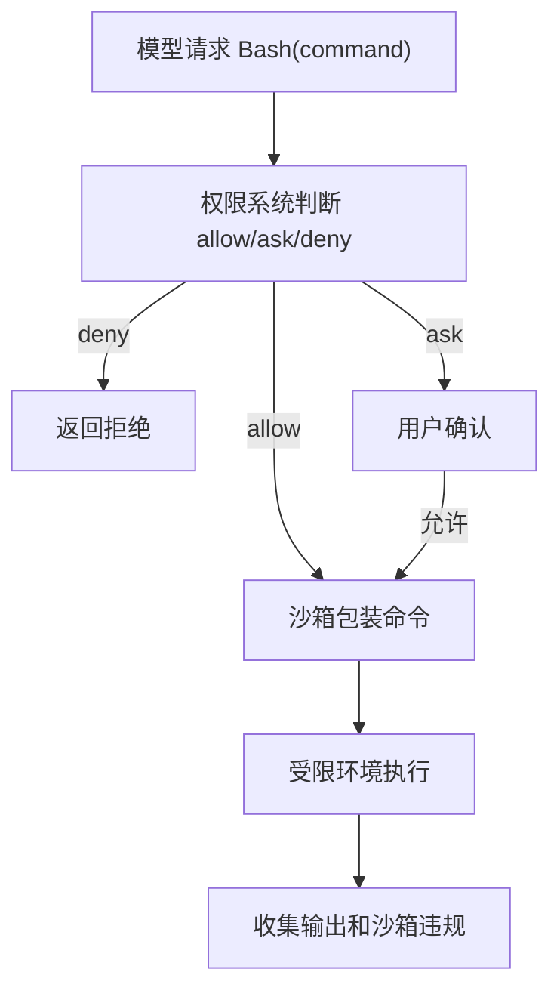
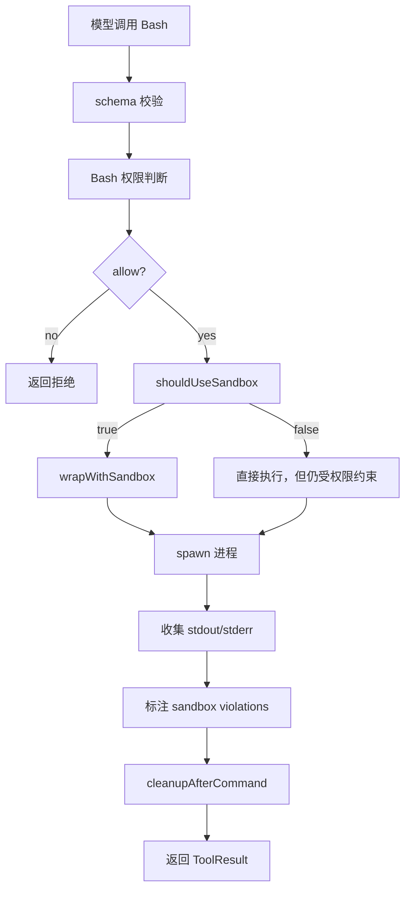

# 第 27 章：沙箱，限制命令执行的真实边界

上一章我们讲了权限规则。权限规则回答的是：

```text
这次工具调用是否应该被允许？
```

本章讲沙箱。沙箱回答的是另一个问题：

```text
即使允许执行，它最多能影响哪里？
```

这是 Agent 安全里非常关键的一层。

权限系统再认真，也不可能完全预测一个命令的所有副作用。

例如用户允许：

```bash
pytest
```

看起来只是运行测试。但测试脚本可以：

- 写 coverage。
- 写缓存。
- 修改快照。
- 启动本地服务。
- 访问网络。
- 执行项目里的自定义脚本。
- 读取环境变量。

权限系统很难在执行前穷尽这些行为。

沙箱的价值就在这里：它不靠“猜命令会做什么”，而是在执行环境层面限制它能读、能写、能连哪里。

## 27.1 沙箱和权限不是一回事

新手最容易混淆两个概念：

```text
权限系统
沙箱系统
```

权限系统是决策层：

```text
模型请求执行 pytest。
系统判断：允许。
```

沙箱系统是执行层：

```text
pytest 可以运行。
但它只能写工作目录和临时目录。
它不能写 ~/.ssh。
它不能访问未授权网络域名。
```

权限系统可以拒绝动作。  
沙箱可以约束动作。  
两者都需要。

如果只有权限系统，没有沙箱：

```text
一旦误允许，命令可以做很多不可控的事。
```

如果只有沙箱，没有权限系统：

```text
模型可能不断尝试危险操作，只是被系统拦住，用户也不知道为什么。
```

正确结构：



## 27.2 Claude Code 里的沙箱源码地图

Claude Code 中沙箱相关源码主要在这些位置：

```text
src/mini_agent/utils/sandbox/sandbox-adapter.py
src/mini_agent/tools/BashTool/shouldUseSandbox.py
src/mini_agent/tools/BashTool/BashTool.python
src/mini_agent/tools/BashTool/prompt.py
src/mini_agent/utils/permissions/pathValidation.py
src/mini_agent/utils/permissions/filesystem.py
src/components/sandbox/*
src/components/permissions/SandboxPermissionRequest.python
```

其中最关键的是：

```text
sandbox-adapter.py
  把 Claude Code 的 settings、permissions、文件系统规则、网络规则转换成 sandbox-runtime 配置。

shouldUseSandbox.py
  决定某次 Bash 命令是否应该进入沙箱。

BashTool.python
  在执行 Bash 工具时调用沙箱包装，并处理沙箱违规输出。

BashTool/prompt.py
  把当前沙箱限制告诉模型，让模型知道默认应该在沙箱内执行。

pathValidation.py / filesystem.py
  把应用层路径权限和沙箱写入白名单连接起来。
```

这个结构很值得学习。

沙箱不是孤立功能。它连接了：

- 用户设置。
- 权限规则。
- Bash 工具。
- 文件系统路径。
- 网络域名。
- UI 提示。
- 日志和错误解释。

## 27.3 沙箱限制什么

一个命令沙箱通常限制三类资源。

第一类：文件系统。

```text
能读哪些路径？
能写哪些路径？
哪些路径即使在允许目录内也不能写？
```

第二类：网络。

```text
能访问哪些域名？
哪些域名被拒绝？
是否允许 Unix socket？
是否允许本地端口绑定？
```

第三类：进程和系统能力。

```text
能否访问系统设备？
能否执行某些系统调用？
能否创建子进程？
能否使用宿主环境变量？
```

不同平台沙箱能力不同。

macOS、Linux、WSL 的底层实现可能不一样。Claude Code 通过 `@anthropic-ai/sandbox-runtime` 做适配，自己的 `sandbox-adapter.py` 再把产品设置转换成 runtime 配置。

教学版不需要一开始实现 OS 级沙箱，但一定要理解目标：

```text
不要只在命令字符串上判断安全，要在运行环境里限制副作用。
```

## 27.4 文件系统写入 allowlist

沙箱最常见的策略是：

```text
默认禁止写。
只允许写某些路径。
```

这叫写入 allowlist。

Claude Code 的沙箱配置里会生成类似：

```text
filesystem.write.allowOnly
filesystem.write.denyWithinAllow
```

意思是：

```text
allowOnly
  只有这些目录可以写。

denyWithinAllow
  即使在可写目录里面，这些路径也不能写。
```

为什么需要 `denyWithinAllow`？

因为工作目录通常是可写的，但工作目录里仍然有敏感路径。

例如：

```text
项目根目录可写。
但 .claude/settings.json 不应该被命令随便写。
项目里的 .claude/skills 也可能影响 Agent 能力，不应该随便写。
.git 某些内部文件也要保护。
```

所以只写：

```text
allowWrite: ["."]
```

不够。

还要写：

```text
denyWrite: [
  ".claude/settings.json",
  ".claude/settings.local.json",
  ".claude/skills",
  ".git/config"
]
```

Claude Code 的 `convertToSandboxRuntimeConfig()` 会默认把当前目录和 Claude 临时目录加入写 allowlist，同时把 settings 文件、managed settings、一些 Git 裸仓库逃逸相关路径放入 denyWrite。

这是成熟工程里很细的地方。

## 27.5 为什么临时目录要特殊处理

命令经常需要写临时文件。

例如：

```bash
pytest
mypy src
pytest
node script.js
```

这些工具可能写：

```text
/tmp
/var/tmp
系统默认 tmpdir
```

如果沙箱完全禁止，它们会失败。

Claude Code 的沙箱 prompt 会告诉模型：

```text
使用 $TMPDIR，不要直接用 /tmp。
```

因为沙箱会设置一个沙箱可写的临时目录。这样命令既能写临时文件，又不会随意写宿主机 `/tmp`。

教学版也可以这样：

```python
from pathlib import Path

def resolve_inside_workspace(workspace: Path, user_path: str) -> Path:
    root = workspace.resolve()
    target = (root / user_path).resolve()
    if root != target and root not in target.parents:
        raise ValueError(f"Path is outside current workspace: {user_path}")
    return target

def read_text_file(workspace: Path, user_path: str) -> str:
    return resolve_inside_workspace(workspace, user_path).read_text(encoding="utf-8")
```

然后在工具提示中告诉模型：

```text
When writing temporary files, use $TMPDIR.
```

这不是小细节。很多命令失败都和临时目录权限有关。

## 27.6 网络限制

网络是 Agent 安全的另一大面。

命令可以通过网络：

- 下载脚本。
- 上传文件。
- 调用外部 API。
- 泄露环境变量。
- 访问内部服务。

所以沙箱需要限制网络。

Claude Code 会从设置和权限规则里提取网络域名。

例如 WebFetch 权限里可能有：

```text
WebFetch(domain:example.com)
```

沙箱可以把它转换成：

```text
allowedDomains: ["example.com"]
```

同时也支持 denied domains。

教学版可以先设计：

```python
from dataclasses import dataclass
from typing import Literal

Decision = Literal["allow", "deny", "ask"]

@dataclass
class PermissionRule:
    source: str
    behavior: Decision
    tool_name: str
    rule_content: str = ""

def format_rule(rule: PermissionRule) -> str:
    content = f"({rule.rule_content})" if rule.rule_content else ""
    return f"{rule.source}:{rule.behavior}:{rule.tool_name}{content}"

def deny_message(rule: PermissionRule) -> dict[str, str]:
    return {
        "behavior": "deny",
        "message": f"Denied by {format_rule(rule)}",
        "reason": "Matched deny rule",
    }
```

执行命令时：

```text
默认拒绝网络。
如果目标 host 在 allowedHosts 中，允许。
如果目标 host 在 deniedHosts 中，拒绝。
```

如果你没有 OS 级网络沙箱，至少可以在 Bash 权限层拒绝常见网络命令：

```text
curl
wget
nc
ssh
scp
rsync
git clone
pip install
pip install
```

但这只是弱保护。真正可靠还是 runtime 网络限制。

## 27.7 Unix socket 和本地绑定

网络不只有 HTTP 域名。

命令还可能访问：

- Unix socket。
- Docker socket。
- SSH agent socket。
- 本地数据库 socket。
- 本地端口。

例如：

```text
/var/run/docker.sock
SSH_AUTH_SOCK
```

访问 Docker socket 可能等价于获得宿主机很高的控制能力。

所以成熟沙箱会有：

```text
allowUnixSockets
allowAllUnixSockets
allowLocalBinding
```

教学版即使不实现，也要在安全设计里承认：

```text
网络限制不能只看域名。
本地 socket 也是能力入口。
```

## 27.8 shouldUseSandbox：什么时候使用沙箱

Claude Code 有一个 `shouldUseSandbox(input)`。

它做几件事：

```text
如果沙箱没启用，不用。
如果用户显式要求 dangerouslyDisableSandbox 且策略允许，不用。
如果没有 command，不用。
如果命令命中 excludedCommands，不用。
否则使用沙箱。
```

这里有个非常重要的注释：`excludedCommands` 不是安全边界。

它只是用户便利功能。

为什么？

因为如果用户配置：

```text
excludedCommands: ["docker"]
```

表示 Docker 命令不进入沙箱，也许是因为 Docker 本身需要复杂系统权限，沙箱里跑不了。

但这不是说 Docker 安全。相反，Docker 可能更危险。

所以绕过沙箱仍然要经过权限系统。

你不能把 excludedCommands 当成：

```text
这些命令安全，所以不用沙箱。
```

应该理解成：

```text
这些命令因兼容性原因不进沙箱，但仍需要权限控制。
```

教学版：

```python
def shouldUseSandbox(input: BashInput, config: SandboxConfig):
    if (not config.enabled) return False

    def if(self, input.dangerouslyDisableSandbox && config.allowUnsandboxedCommands):
        return False

    if (not input.command) return False

    def if(self, matchesExcludedCommand(input.command, config.excludedCommands)):
        return False

    return True
```

然后在代码注释里写清楚：

```text
excludedCommands is not a security boundary.
```

## 27.9 dangerouslyDisableSandbox 为什么危险

Claude Code 的 Bash 输入 schema 里有：

```text
dangerouslyDisableSandbox
```

名字很长，而且故意带 `dangerously`。

这是一种产品设计信号：告诉模型和开发者，这不是普通开关。

为什么需要这个字段？

因为有些命令确实在沙箱里跑不了。

例如：

- 需要访问系统级 socket。
- 需要写沙箱外缓存。
- 需要访问未列入白名单的网络。
- 需要调试沙箱限制本身。

但这个字段不能被模型随便使用。

Claude Code 的 prompt 里会强调：

```text
默认在沙箱里运行。
只有用户明确要求绕过，或者命令刚因沙箱限制失败并有明确证据时，才考虑绕过。
```

并且绕过会触发权限提示。

教学版也应该这样：

```python
def if(self, input.dangerouslyDisableSandbox):
    decision = await canUseTool(
    BashTool
    input
    permissionContext.withReason("sandbox override")
    )

    if decision.behavior !== "allow":
        return denied(decision.message)
```

不要让模型通过传一个 boolean 就直接获得无沙箱执行。

## 27.10 沙箱失败如何反馈给模型

命令在沙箱里失败时，模型需要知道原因。

常见错误：

```text
Operation not permitted
Permission denied
Network connection refused
Access denied to path
Unix socket connection error
```

Claude Code 会把 sandbox violation 注入输出中，再在 UI 中提取和展示。

这有两个目的。

第一，让用户知道：

```text
命令不是业务失败，而是被沙箱拦了。
```

第二，让模型知道：

```text
如果确实需要，可以请求绕过或建议用户调整沙箱。
```

教学版可以简单地包装错误：

```python
from pathlib import Path

def resolve_inside_workspace(workspace: Path, user_path: str) -> Path:
    root = workspace.resolve()
    target = (root / user_path).resolve()
    if root != target and root not in target.parents:
        raise ValueError(f"Path is outside current workspace: {user_path}")
    return target

def read_text_file(workspace: Path, user_path: str) -> str:
    return resolve_inside_workspace(workspace, user_path).read_text(encoding="utf-8")
```

如果命令失败：

```text
返回普通 stderr + sandboxViolations
```

不要把沙箱失败伪装成普通命令失败。

## 27.11 沙箱失败后是否自动重试

Claude Code 的提示里有一个很实用的行为：如果模型看到明确沙箱限制证据，可以重试并设置 `dangerouslyDisableSandbox: true`，但这会提示用户授权。

这里要注意三点。

第一，不是所有失败都是沙箱导致的。

例如：

```text
file not found
command not found
test failed
invalid argument
```

这些不是沙箱问题。

第二，绕过沙箱应该按命令逐次处理。

不能因为刚才一个命令绕过了沙箱，后面所有命令都绕过。

第三，不能建议把敏感路径加入 allowlist。

例如：

```text
~/.ssh
~/.bashrc
~/.zshrc
credential files
```

这些路径如果被加入 allowlist，会变成长期风险。

教学版策略：

```text
看到明确沙箱错误：
  可以 ask 用户是否允许本次无沙箱重试。

没有明确沙箱错误：
  不要自动绕过。
```

## 27.12 autoAllowBashIfSandboxed

沙箱还有一个体验相关能力：如果 Bash 命令会在沙箱里执行，是否可以自动允许？

Claude Code 里有类似：

```text
autoAllowBashIfSandboxed
```

意思是：

```text
如果命令进入沙箱，且没有命中显式 deny/ask 规则，可以自动 allow。
```

这能减少很多确认。

但它必须满足条件：

- 沙箱真的启用。
- 当前命令确实会进入沙箱。
- 没有显式 deny。
- 没有显式 ask。
- 策略允许自动放行。

不能写成：

```python
if (sandboxEnabled) allowAllBash()
```

因为有些命令可能通过 excludedCommands 或 dangerouslyDisableSandbox 不进沙箱。

教学版：

```python
from dataclasses import dataclass
from typing import Literal

Decision = Literal["allow", "deny", "ask"]

@dataclass
class PermissionRule:
    source: str
    behavior: Decision
    tool_name: str
    rule_content: str = ""

def format_rule(rule: PermissionRule) -> str:
    content = f"({rule.rule_content})" if rule.rule_content else ""
    return f"{rule.source}:{rule.behavior}:{rule.tool_name}{content}"

def deny_message(rule: PermissionRule) -> dict[str, str]:
    return {
        "behavior": "deny",
        "message": f"Denied by {format_rule(rule)}",
        "reason": "Matched deny rule",
    }
```

这个功能能明显改善体验，但需要严格测试。

## 27.13 沙箱配置从哪里来

Claude Code 的 `convertToSandboxRuntimeConfig()` 会把多个来源合成一个 runtime config：

- settings 中的 sandbox 配置。
- permissions.allow / permissions.deny 中的文件和 WebFetch 规则。
- 当前工作目录。
- Claude 临时目录。
- 额外工作目录。
- policy settings。
- project settings。
- local settings。

合成后的结构大致是：

```python
from dataclasses import dataclass
from typing import Literal

Decision = Literal["allow", "deny", "ask"]

@dataclass
class PermissionRule:
    source: str
    behavior: Decision
    tool_name: str
    rule_content: str = ""

def format_rule(rule: PermissionRule) -> str:
    content = f"({rule.rule_content})" if rule.rule_content else ""
    return f"{rule.source}:{rule.behavior}:{rule.tool_name}{content}"

def deny_message(rule: PermissionRule) -> dict[str, str]:
    return {
        "behavior": "deny",
        "message": f"Denied by {format_rule(rule)}",
        "reason": "Matched deny rule",
    }
```

教学版可以先从三个地方生成：

```text
当前项目目录。
临时目录。
用户配置的 allowed hosts。
```

例如：

```python
from dataclasses import dataclass
from typing import Literal

Decision = Literal["allow", "deny", "ask"]

@dataclass
class PermissionRule:
    source: str
    behavior: Decision
    tool_name: str
    rule_content: str = ""

def format_rule(rule: PermissionRule) -> str:
    content = f"({rule.rule_content})" if rule.rule_content else ""
    return f"{rule.source}:{rule.behavior}:{rule.tool_name}{content}"

def deny_message(rule: PermissionRule) -> dict[str, str]:
    return {
        "behavior": "deny",
        "message": f"Denied by {format_rule(rule)}",
        "reason": "Matched deny rule",
    }
```

然后逐步支持从规则中提取路径。

## 27.14 设置变化后要刷新沙箱

沙箱配置不是启动后永远不变。

用户可能在会话中：

- 添加允许目录。
- 添加允许域名。
- 修改 sandbox.enabled。
- 修改 allowUnsandboxedCommands。
- 通过权限弹窗添加规则。

Claude Code 的 sandbox adapter 会订阅 settings change，并更新 runtime config。

教学版也要考虑：

```python
from dataclasses import dataclass
from typing import Literal

Decision = Literal["allow", "deny", "ask"]

@dataclass
class PermissionRule:
    source: str
    behavior: Decision
    tool_name: str
    rule_content: str = ""

def format_rule(rule: PermissionRule) -> str:
    content = f"({rule.rule_content})" if rule.rule_content else ""
    return f"{rule.source}:{rule.behavior}:{rule.tool_name}{content}"

def deny_message(rule: PermissionRule) -> dict[str, str]:
    return {
        "behavior": "deny",
        "message": f"Denied by {format_rule(rule)}",
        "reason": "Matched deny rule",
    }
```

否则会出现竞态：

```text
用户刚允许写某目录。
权限系统更新了。
沙箱还没更新。
命令仍然写失败。
```

这类体验会很糟糕。

## 27.15 沙箱不可用时怎么办

不是所有机器都能运行沙箱。

原因可能包括：

- 平台不支持。
- 缺少依赖。
- WSL 版本不支持。
- 用户关闭了沙箱。
- 企业策略限制。

Claude Code 有 `getSandboxUnavailableReason()`，用于在用户启用了沙箱但实际无法运行时给出原因。

这个点很重要。

如果用户配置了：

```json
{
  "sandbox": {
    "enabled": true
  }
}
```

但依赖缺失，程序静默降级为无沙箱，这就是安全脚枪。

正确做法：

```text
如果用户明确启用沙箱，但沙箱不可用，要显示警告。
如果设置 failIfUnavailable，则直接失败。
```

教学版：

```python
from typing import Any

def example(context: dict[str, Any]) -> dict[str, Any]:
    return {"ok": True, "context": context}
```

安全配置不能悄悄失效。

## 27.16 沙箱和 Git 的特殊问题

Git 是开发 Agent 里最常用的命令之一，但它也带来特殊问题。

命令：

```bash
git status
git diff
git log
```

看起来只读。

但 Git 会读取 `.git`，有些操作会写 lock 文件，有些配置可能触发 hooks 或 fsmonitor。

Claude Code 的沙箱源码里有专门处理 Git worktree、裸仓库文件、`.git` 相关路径的逻辑。

其中一个安全点是：如果攻击者在当前目录种下类似裸仓库结构的文件，后续 unsandboxed git 可能被影响。因此沙箱执行后会 scrub 某些 planted bare repo files。

新手不需要马上实现这么细，但要理解：

```text
“看起来只读”的开发工具，也可能有隐式写入和配置执行。
```

所以不要轻易把 Git 全部当成无风险。

## 27.17 沙箱和提示词

沙箱不只是 runtime 功能，还要告诉模型怎么配合。

Claude Code 的 Bash prompt 会包含沙箱说明：

- 默认命令会在沙箱中运行。
- 沙箱限制哪些文件系统和网络资源。
- 什么时候可以请求绕过沙箱。
- 临时文件要用 `$TMPDIR`。
- 不要建议把敏感路径加入 allowlist。

为什么要告诉模型？

因为模型如果不知道沙箱存在，可能会：

- 反复尝试写 `/tmp`。
- 误判网络失败。
- 不知道如何恢复。
- 随便建议扩大 allowlist。

提示词不能替代沙箱，但可以让模型更好地在沙箱内工作。

教学版可以在 Bash 工具描述里加入：

```text
Commands run in a sandbox by default.
Use $TMPDIR for temporary files.
If a command fails due to sandbox restrictions, explain the likely restriction and ask before retrying without sandbox.
```

## 27.18 实现一个教学版软沙箱

如果你暂时没有 OS 级沙箱，可以先实现软沙箱。

软沙箱不能防住所有绕过，但能帮助你建立接口和流程。

设计：

```python
from dataclasses import dataclass
from typing import Literal

Decision = Literal["allow", "deny", "ask"]

@dataclass
class PermissionRule:
    source: str
    behavior: Decision
    tool_name: str
    rule_content: str = ""

def format_rule(rule: PermissionRule) -> str:
    content = f"({rule.rule_content})" if rule.rule_content else ""
    return f"{rule.source}:{rule.behavior}:{rule.tool_name}{content}"

def deny_message(rule: PermissionRule) -> dict[str, str]:
    return {
        "behavior": "deny",
        "message": f"Denied by {format_rule(rule)}",
        "reason": "Matched deny rule",
    }
```

执行前：

```python
import asyncio
from dataclasses import dataclass

@dataclass
class CommandResult:
    command: str
    exit_code: int | None
    stdout: str
    stderr: str
    timed_out: bool = False

async def run_command(command: str, cwd: str, timeout: float = 30.0) -> CommandResult:
    process = await asyncio.create_subprocess_shell(
        command,
        cwd=cwd,
        stdout=asyncio.subprocess.PIPE,
        stderr=asyncio.subprocess.PIPE,
    )
    try:
        stdout, stderr = await asyncio.wait_for(process.communicate(), timeout=timeout)
        return CommandResult(command, process.returncode, stdout.decode(), stderr.decode())
    except asyncio.TimeoutError:
        process.kill()
        return CommandResult(command, None, "", "命令超时", True)
```

Bash 权限层补充：

```python
import asyncio
from dataclasses import dataclass

@dataclass
class CommandResult:
    command: str
    exit_code: int | None
    stdout: str
    stderr: str
    timed_out: bool = False

async def run_command(command: str, cwd: str, timeout: float = 30.0) -> CommandResult:
    process = await asyncio.create_subprocess_shell(
        command,
        cwd=cwd,
        stdout=asyncio.subprocess.PIPE,
        stderr=asyncio.subprocess.PIPE,
    )
    try:
        stdout, stderr = await asyncio.wait_for(process.communicate(), timeout=timeout)
        return CommandResult(command, process.returncode, stdout.decode(), stderr.decode())
    except asyncio.TimeoutError:
        process.kill()
        return CommandResult(command, None, "", "命令超时", True)
```

再次强调：软沙箱不是强安全边界。但它能帮你把上层架构搭好，之后替换成真正 runtime。

## 27.19 接入 OS 级沙箱时的接口

为了以后替换实现，建议定义接口：

```python
import asyncio
from dataclasses import dataclass

@dataclass
class CommandResult:
    command: str
    exit_code: int | None
    stdout: str
    stderr: str
    timed_out: bool = False

async def run_command(command: str, cwd: str, timeout: float = 30.0) -> CommandResult:
    process = await asyncio.create_subprocess_shell(
        command,
        cwd=cwd,
        stdout=asyncio.subprocess.PIPE,
        stderr=asyncio.subprocess.PIPE,
    )
    try:
        stdout, stderr = await asyncio.wait_for(process.communicate(), timeout=timeout)
        return CommandResult(command, process.returncode, stdout.decode(), stderr.decode())
    except asyncio.TimeoutError:
        process.kill()
        return CommandResult(command, None, "", "命令超时", True)
```

Bash 工具只依赖接口：

```python
commandToRun = shouldUseSandbox(input, config)
? await sandbox.wrapCommand(input.command,:
    "shell": "/bin/bash"
    config
    signal
: input.command
```

这样你的 Agent 不会被某个具体沙箱实现绑死。

## 27.20 沙箱执行流程

一个完整 Bash 执行流程可以是：



注意：

```text
直接执行不代表无需权限。
```

它只是没有沙箱包装。

## 27.21 沙箱违规结果展示

沙箱违规应该对用户可见，但不要污染模型太多。

Claude Code 会从 stderr 中提取 sandbox violation，然后 UI 展示更友好的信息。

教学版可以返回：

```python

    "stdout": "..."
    "stderr": "..."
    "sandbox"::
        "violated": True
        "violations": [
        { type: "network", target: "api.example.com" }
        ]
```

展示给用户：

```text
Command was blocked by sandbox network policy: api.example.com
```

给模型：

```text
The command failed because the sandbox blocked network access to api.example.com.
```

模型拿到这个信息后，可以：

- 改用本地文件。
- 请求用户允许该 host。
- 解释无法完成。

## 27.22 沙箱规则不要无限扩大

沙箱最常见的退化方式是：每次失败就加 allowlist。

最后变成：

```text
allowWrite: ["~"]
allowedHosts: ["*"]
```

这等于没有沙箱。

所以 UI 和模型都应该遵守：

```text
优先改命令。
其次使用 $TMPDIR。
再次添加最窄 allowlist。
最后才考虑无沙箱重试。
```

例如命令想写：

```text
/tmp/output.txt
```

不要建议允许 `/tmp/**`。

应该建议：

```bash
output="$TMPDIR/output.txt"
```

例如命令想访问：

```text
pypi.org
```

如果用户确实要安装依赖，可以只允许这个域名，而不是允许所有网络。

## 27.23 沙箱测试清单

沙箱必须测试这些场景。

测试一：沙箱启用时，普通命令会被 wrap。

测试二：沙箱关闭时，命令不会 wrap。

测试三：`dangerouslyDisableSandbox` 只有在策略允许时生效。

测试四：excluded command 不进入沙箱，但仍然经过权限系统。

测试五：写 allowlist 外路径失败。

测试六：写 allowlist 内但 denyWithinAllow 的路径失败。

测试七：写 `$TMPDIR` 成功。

测试八：访问未允许网络 host 失败。

测试九：访问允许网络 host 成功。

测试十：沙箱不可用且 failIfUnavailable 为 true 时失败。

测试十一：设置变化后 runtime config 刷新。

测试十二：沙箱违规能被结构化记录。

测试十三：自动 allow Bash 只在实际 sandboxed 时发生。

测试十四：绕过沙箱不会影响后续命令默认策略。

测试十五：敏感路径不会被建议加入 allowlist。

## 27.24 常见错误

错误一：把沙箱当成权限系统。

正确做法：权限先判断，沙箱再执行限制。

错误二：把 excludedCommands 当成安全边界。

正确做法：它只是兼容性功能，命令仍需权限。

错误三：用户启用沙箱但不可用时静默降级。

正确做法：显示原因，必要时 fail closed。

错误四：临时文件继续写 `/tmp`。

正确做法：使用 `$TMPDIR`。

错误五：沙箱失败后总是无沙箱重试。

正确做法：只有明确沙箱证据时才请求绕过。

错误六：allowlist 过宽。

正确做法：添加最小目录、最小域名。

错误七：autoAllowBashIfSandboxed 不检查命令是否实际进入沙箱。

正确做法：必须同时调用 `shouldUseSandbox()`。

错误八：设置变化后不刷新 runtime config。

正确做法：订阅 settings change 或每次执行前刷新。

错误九：忽略 Unix socket。

正确做法：把本地 socket 当成高权限能力入口。

错误十：沙箱违规只作为普通 stderr。

正确做法：结构化提取，清楚展示。

## 27.25 本章练习

练习一：定义 `SandboxConfig`。

包含：

- allowWrite
- denyWrite
- allowedHosts
- deniedHosts
- tmpDir
- allowUnsandboxedCommands
- excludedCommands

练习二：实现 `shouldUseSandbox()`。

要求：

- sandbox disabled 返回 false。
- `dangerouslyDisableSandbox` 只有策略允许时返回 false。
- excluded command 返回 false。
- 默认返回 true。

练习三：实现 `$TMPDIR` 注入。

运行命令时，把 TMPDIR、TMP、TEMP 都指向沙箱临时目录。

练习四：实现沙箱不可用提示。

如果用户启用沙箱但依赖缺失，给出明确错误。

练习五：实现沙箱违规结构。

把 stderr 中的权限错误转换为：

```python
{ type: "filesystem", target: "...", message: "..." }
```

练习六：实现 autoAllowBashIfSandboxed。

要求显式 deny/ask 仍然优先。

练习七：写测试证明 excludedCommands 仍然会走权限系统。

练习八：设计一个网络 allowlist。

只允许：

```text
pypi.org
api.github.com
```

练习九：思考题：

```text
为什么允许访问 Docker socket 可能比允许访问普通网络更危险？
```

练习十：把沙箱配置变化和权限规则变化连接起来。

当用户添加 `Edit(src/**)` allow 规则后，沙箱写 allowlist 自动刷新。

## 27.26 本章小结

本章我们讲了沙箱。

你应该理解：

1. 权限系统决定是否执行，沙箱限制执行副作用。
2. 文件系统沙箱需要 allowWrite 和 denyWithinAllow。
3. 临时目录要使用 `$TMPDIR`。
4. 网络限制要考虑域名、socket 和本地绑定。
5. `excludedCommands` 不是安全边界。
6. `dangerouslyDisableSandbox` 必须经过权限控制。
7. 沙箱失败要结构化反馈给用户和模型。
8. 自动允许 Bash 只能在命令实际进入沙箱时使用。
9. 用户明确启用沙箱但沙箱不可用时，不能静默降级。
10. 沙箱配置要随着权限和设置变化刷新。

到这里，第 4 卷已经有三层：安全总览、权限规则、执行沙箱。下一章我们会讲 hooks 与外部策略：如何让项目、企业或用户用自定义逻辑参与工具执行前后的安全决策。
