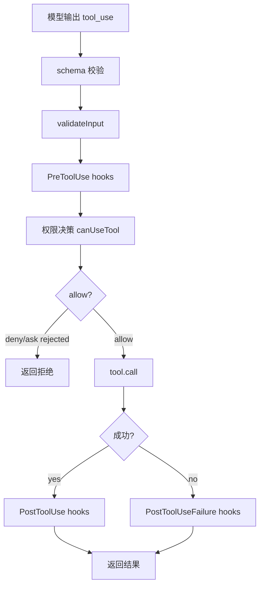

# 第 28 章：Hooks 与外部策略，让 Agent 可被项目和组织治理

前面三章我们讲了安全总览、权限规则和沙箱。

这些机制已经能保护一个基础 Agent。但当 Agent 进入真实团队、真实项目、真实公司环境时，还会出现新的需求：

```text
项目想在执行工具前检查自己的规则。
公司想阻止某些命令。
用户想在工具执行后自动记录日志。
CI 想在失败时收集额外上下文。
安全团队想对权限请求做外部审批。
```

如果所有策略都写死在 Agent 核心代码里，系统会很快变得臃肿。每个团队都要改核心代码，最后核心代码会塞满各种特殊判断。

Hooks 的意义就是把核心执行流程开放出一些受控插槽：

```text
在关键时刻，允许外部逻辑参与。
```

这一章我们讲 hooks。

## 28.1 Hooks 是什么

Hook 可以理解为：

```text
Agent 生命周期中的事件回调。
```

例如：

```text
用户提交 prompt 前。
工具执行前。
工具执行后。
工具失败后。
权限被拒绝后。
会话开始时。
当前目录变化时。
文件变化时。
```

每个 hook 都能收到上下文，并返回结构化结果。

最常见的 hook：

```text
PreToolUse
  工具执行前运行。

PostToolUse
  工具成功执行后运行。

PostToolUseFailure
  工具执行失败后运行。

PermissionRequest
  需要权限确认时运行。

PermissionDenied
  权限被拒绝后运行。
```

Hooks 不是让外部代码随便接管系统。好的 hook 系统必须有明确边界：

- hook 能看什么。
- hook 能改什么。
- hook 能阻止什么。
- hook 超时怎么办。
- hook 报错怎么办。
- hook 的 allow 是否能绕过用户配置。

Claude Code 的 hook 设计就体现了这些边界。

## 28.2 为什么需要 Hooks

先看几个真实场景。

场景一：项目安全策略。

项目希望禁止 Agent 修改数据库迁移文件：

```text
如果 Edit 目标在 migrations/**，强制 ask。
```

场景二：企业命令策略。

公司希望禁止：

```bash
kubectl delete
terraform destroy
aws iam *
```

场景三：自动上下文补充。

当 Agent 运行测试失败后，hook 自动读取测试报告路径，把失败摘要加入上下文。

场景四：外部审批。

当 Agent 想发送 Slack 消息或创建 GitHub issue 时，hook 把请求发给一个审批服务。

场景五：审计日志。

每次 Bash 执行后，hook 把命令、退出码、cwd、耗时写到企业日志系统。

这些需求都不适合写死在核心工具里。

Hooks 提供了扩展点。

## 28.3 Hook 系统的位置

在工具执行流程里，hooks 的位置大概是：



注意：

```text
PreToolUse 在权限判断之前。
PostToolUse 在工具执行之后。
PostToolUseFailure 在工具失败之后。
```

这个位置安排很关键。

PreToolUse 能：

- 阻止工具。
- 修改输入。
- 要求 ask。
- 追加上下文。

但它不应该无条件绕过权限系统。

PostToolUse 能：

- 记录日志。
- 追加上下文。
- 修改 MCP 工具输出。
- 阻止后续继续。

但它不能改变已经发生的副作用。

## 28.4 Claude Code 的 Hook 输出结构

Claude Code 的 hook 输出是 JSON 结构，不是随便打印文字。

同步 hook 可以返回：

```json
{
  "continue": true,
  "suppressOutput": false,
  "decision": "approve",
  "reason": "allowed by company policy",
  "systemMessage": "..."
}
```

还可以返回 hook-specific output。

例如 PreToolUse：

```json
{
  "hookSpecificOutput": {
    "hookEventName": "PreToolUse",
    "permissionDecision": "ask",
    "permissionDecisionReason": "Editing deployment files requires approval",
    "updatedInput": {
      "file_path": "..."
    },
    "additionalContext": "..."
  }
}
```

PermissionRequest：

```json
{
  "hookSpecificOutput": {
    "hookEventName": "PermissionRequest",
    "decision": {
      "behavior": "allow",
      "updatedPermissions": []
    }
  }
}
```

PostToolUse：

```json
{
  "hookSpecificOutput": {
    "hookEventName": "PostToolUse",
    "additionalContext": "Test report summarized...",
    "updatedMCPToolOutput": {}
  }
}
```

结构化输出的好处是：

- 程序能验证。
- 不同事件能有不同字段。
- 错误更容易定位。
- 不会靠解析自然语言做控制流。

教学版也应该用 JSON schema 或 Zod 校验 hook 输出。

## 28.5 PreToolUse：工具执行前的策略闸门

PreToolUse 是最重要的 hook。

它运行在工具执行前，甚至在最终权限决策前。

它可以做几类事。

第一，拒绝工具：

```json
{
  "hookSpecificOutput": {
    "hookEventName": "PreToolUse",
    "permissionDecision": "deny",
    "permissionDecisionReason": "kubectl delete is blocked"
  }
}
```

第二，强制询问：

```json
{
  "hookSpecificOutput": {
    "hookEventName": "PreToolUse",
    "permissionDecision": "ask",
    "permissionDecisionReason": "Deployment workflow edits require approval"
  }
}
```

第三，批准：

```json
{
  "hookSpecificOutput": {
    "hookEventName": "PreToolUse",
    "permissionDecision": "allow",
    "permissionDecisionReason": "Approved by policy"
  }
}
```

第四，修改输入：

```json
{
  "hookSpecificOutput": {
    "hookEventName": "PreToolUse",
    "updatedInput": {
      "command": "pytest -- --runInBand"
    }
  }
}
```

第五，追加上下文：

```json
{
  "hookSpecificOutput": {
    "hookEventName": "PreToolUse",
    "additionalContext": "This project uses uv, not raw pip."
  }
}
```

这些能力很强，所以要谨慎设计。

## 28.6 Hook allow 不能绕过 deny / ask 规则

Claude Code 源码里有一个非常重要的原则：

```text
hook allow does NOT bypass settings.json deny/ask rules.
```

这句话很值钱。

为什么？

假设企业策略里有：

```text
deny Bash(kubectl delete *)
```

某个项目 hook 返回：

```text
allow
```

如果 hook allow 能绕过 deny 规则，企业策略就失效了。

所以正确语义是：

```text
hook 可以批准跳过交互提示，但不能覆盖更高优先级 deny/ask 规则。
```

在 Claude Code 中，`resolveHookPermissionDecision()` 会在 hook 返回 allow 后继续检查 rule-based permissions。如果命中 deny，deny 覆盖 hook allow。如果命中 ask，仍然需要走 `canUseTool`。

教学版也应该这样：

```python
from dataclasses import dataclass
from typing import Literal

Decision = Literal["allow", "deny", "ask"]

@dataclass
class PermissionRule:
    source: str
    behavior: Decision
    tool_name: str
    rule_content: str = ""

def format_rule(rule: PermissionRule) -> str:
    content = f"({rule.rule_content})" if rule.rule_content else ""
    return f"{rule.source}:{rule.behavior}:{rule.tool_name}{content}"

def deny_message(rule: PermissionRule) -> dict[str, str]:
    return {
        "behavior": "deny",
        "message": f"Denied by {format_rule(rule)}",
        "reason": "Matched deny rule",
    }
```

这个规则让 hooks 可扩展，但不会越权。

## 28.7 Hook 修改 input 的风险

PreToolUse hook 可以修改 input。

这很有用。

例如：

```text
把原始安装命令改成项目约定的 uv 命令。
把相对路径规范化。
给测试命令加稳定参数。
把危险输出路径改到 $TMPDIR。
```

但它也有风险。

如果权限检查用的是旧 input，执行用的是新 input，就会出现漏洞：

```text
权限检查：Edit(src/index.py)
hook 修改：Edit(.ssh/config)
执行：写 .ssh/config
```

所以必须规定：

```text
hook 修改 input 后，后续权限检查必须基于修改后的 input。
```

Claude Code 的流程也是这样：hook updatedInput 会更新 processedInput，然后进入权限流。

教学版：

```python
input = parsedInput

hookResult = await runPreToolUseHooks(tool, input)
def if(self, hookResult.updatedInput):
    input = hookResult.updatedInput

decision = await canUseTool(tool, input, context)
```

不要在权限检查后再允许 hook 改 input，除非重新检查权限。

## 28.8 continue 和 preventContinuation

Hook 不一定只控制工具是否执行，还可以控制 Agent 是否继续。

例如某个 PostToolUse hook 发现：

```text
工具执行结果包含严重安全问题。
```

它可以阻止模型继续下一步。

Claude Code hook 输出里有：

```text
continue
stopReason
```

以及内部的 preventContinuation。

教学版可以设计：

```python
from dataclasses import dataclass
from typing import Any, Protocol

@dataclass
class HookControl:
    continue: bool
    stopReason: str
```

语义：

```text
continue: false
  停止当前 Agent 循环，不再让模型继续行动。

stopReason
  告诉用户为什么停。
```

这常用于：

- 安全策略阻断。
- 外部审批失败。
- 工具结果触发人工接管。
- 自动化流程达到终点。

## 28.9 PostToolUse：执行后的观察和修正

PostToolUse 在工具成功后运行。

它不能撤销已经发生的副作用，但可以：

- 记录日志。
- 添加上下文。
- 修改 MCP 工具输出。
- 阻止后续继续。
- 触发外部通知。

例如测试命令执行后，hook 读取测试报告：

```json
{
  "hookSpecificOutput": {
    "hookEventName": "PostToolUse",
    "additionalContext": "3 tests failed. Main failure: ..."
  }
}
```

模型下一轮就能用这段上下文继续修复。

再比如 MCP 工具返回太多敏感字段，hook 可以清理 MCP 输出：

```json
{
  "hookSpecificOutput": {
    "hookEventName": "PostToolUse",
    "updatedMCPToolOutput": {
      "safe": "redacted output"
    }
  }
}
```

Claude Code 只允许 `updatedMCPToolOutput` 应用于 MCP 工具，这也很合理。不要让 hooks 随意篡改所有内置工具结果，否则调试会很困难。

## 28.10 PostToolUseFailure：失败后的补救

工具失败后也应该有 hook。

例如：

```text
Bash pytest 失败。
```

PostToolUseFailure hook 可以：

- 收集测试日志。
- 读取 coverage。
- 提供排错建议。
- 记录失败事件。
- 通知外部系统。

这比让模型盲目猜错误原因更好。

教学版：

```python
from dataclasses import dataclass
from typing import Literal

Decision = Literal["allow", "deny", "ask"]

@dataclass
class PermissionRule:
    source: str
    behavior: Decision
    tool_name: str
    rule_content: str = ""

def format_rule(rule: PermissionRule) -> str:
    content = f"({rule.rule_content})" if rule.rule_content else ""
    return f"{rule.source}:{rule.behavior}:{rule.tool_name}{content}"

def deny_message(rule: PermissionRule) -> dict[str, str]:
    return {
        "behavior": "deny",
        "message": f"Denied by {format_rule(rule)}",
        "reason": "Matched deny rule",
    }
```

输出：

```python
from dataclasses import dataclass
from typing import Any, Protocol

@dataclass
class PostToolUseFailureHookOutput:
    additionalContext: str
    continue: bool
    stopReason: str
```

注意：失败 hook 不应该默认重试工具。它最多提供上下文或建议。重试仍然应该由 Agent 循环决定，并再次走权限。

## 28.11 PermissionRequest hook

PermissionRequest hook 发生在需要权限确认时。

它适合 SDK、企业 host、远程执行等场景。

例如 CLI 里可以弹窗问用户。  
SDK 场景可能没有终端 UI，但 host 可以通过 API 决定：

```text
allow
deny
```

Claude Code 的 PermissionRequest hook 输出支持：

```text
allow with updatedInput / updatedPermissions
deny with message / interrupt
```

教学版：

```python
from dataclasses import dataclass
from typing import Literal

Decision = Literal["allow", "deny", "ask"]

@dataclass
class PermissionRule:
    source: str
    behavior: Decision
    tool_name: str
    rule_content: str = ""

def format_rule(rule: PermissionRule) -> str:
    content = f"({rule.rule_content})" if rule.rule_content else ""
    return f"{rule.source}:{rule.behavior}:{rule.tool_name}{content}"

def deny_message(rule: PermissionRule) -> dict[str, str]:
    return {
        "behavior": "deny",
        "message": f"Denied by {format_rule(rule)}",
        "reason": "Matched deny rule",
    }
```

这使得权限确认不一定绑定在本地 TUI 上。

## 28.12 PermissionDenied hook

PermissionDenied hook 在权限被拒绝后运行。

它的典型用途：

- 记录安全拒绝。
- 通知用户或管理员。
- 检查外部策略是否刚更新。
- 告诉模型是否可以重试。

Claude Code 中有一个细节：对于 auto mode classifier 的拒绝，如果 PermissionDenied hook 返回 retry，系统会告诉模型：

```text
The PermissionDenied hook indicated this command is now approved. You may retry it.
```

这说明 hook 可以参与恢复流程。

但要注意：retry 不是自动执行。它只是告诉模型可以重新尝试，而重新尝试仍然会走完整权限链路。

## 28.13 Hook 运行要有超时

Hook 是外部代码。外部代码可能：

- 卡住。
- 崩溃。
- 输出非法 JSON。
- 运行很慢。
- 等待网络。

所以 hook runner 必须有超时。

教学版：

```python
import asyncio
from dataclasses import dataclass
from typing import Any

@dataclass
class HookResult:
    status: str
    message: str = ""

async def run_hook(name: str, payload: dict[str, Any], timeout: float = 5.0) -> HookResult:
    try:
        await asyncio.wait_for(asyncio.sleep(0), timeout=timeout)
        return HookResult("ok", f"hook 已执行: {name}")
    except asyncio.TimeoutError:
        return HookResult("timeout", f"hook 超时: {name}")
```

超时后怎么办？

取决于 hook 类型。

安全相关 hook：

```text
fail closed，返回 deny 或 ask。
```

观察类 hook：

```text
记录错误，继续。
```

这个策略要可配置。

## 28.14 Hook 错误不能让系统失控

Hook 报错时，系统不能进入不确定状态。

例如 PreToolUse hook 报错：

```text
是继续执行，还是拒绝？
```

保守策略：

```text
如果 hook 是安全策略 hook，报错则 ask 或 deny。
如果 hook 是日志 hook，报错则记录并继续。
```

所以 hook 配置最好包含：

```python
from dataclasses import dataclass
from typing import Literal

Decision = Literal["allow", "deny", "ask"]

@dataclass
class PermissionRule:
    source: str
    behavior: Decision
    tool_name: str
    rule_content: str = ""

def format_rule(rule: PermissionRule) -> str:
    content = f"({rule.rule_content})" if rule.rule_content else ""
    return f"{rule.source}:{rule.behavior}:{rule.tool_name}{content}"

def deny_message(rule: PermissionRule) -> dict[str, str]:
    return {
        "behavior": "deny",
        "message": f"Denied by {format_rule(rule)}",
        "reason": "Matched deny rule",
    }
```

不要把所有 hook 错误都当作普通 warning。

## 28.15 Hook 输出必须校验

Hook 输出来自外部程序，不能信任。

必须校验：

- 是否是 JSON。
- 字段是否符合 schema。
- hookEventName 是否和当前事件一致。
- updatedInput 是否仍符合工具 input schema。
- permissionDecision 是否是 allow/ask/deny。
- additionalContext 是否过大。

Claude Code 使用 Zod schema 校验 hook JSON output。

教学版：

```python
from dataclasses import dataclass
from typing import Literal

Decision = Literal["allow", "deny", "ask"]

@dataclass
class PermissionRule:
    source: str
    behavior: Decision
    tool_name: str
    rule_content: str = ""

def format_rule(rule: PermissionRule) -> str:
    content = f"({rule.rule_content})" if rule.rule_content else ""
    return f"{rule.source}:{rule.behavior}:{rule.tool_name}{content}"

def deny_message(rule: PermissionRule) -> dict[str, str]:
    return {
        "behavior": "deny",
        "message": f"Denied by {format_rule(rule)}",
        "reason": "Matched deny rule",
    }
```

如果校验失败：

```text
按 failurePolicy 处理。
```

不要让非法输出默默生效。

## 28.16 Hook 的上下文输入

Hook 需要足够上下文才能做判断。

PreToolUse 输入可以包含：

```python
from dataclasses import dataclass
from typing import Literal

Decision = Literal["allow", "deny", "ask"]

@dataclass
class PermissionRule:
    source: str
    behavior: Decision
    tool_name: str
    rule_content: str = ""

def format_rule(rule: PermissionRule) -> str:
    content = f"({rule.rule_content})" if rule.rule_content else ""
    return f"{rule.source}:{rule.behavior}:{rule.tool_name}{content}"

def deny_message(rule: PermissionRule) -> dict[str, str]:
    return {
        "behavior": "deny",
        "message": f"Denied by {format_rule(rule)}",
        "reason": "Matched deny rule",
    }
```

PostToolUse 输入：

```python
from dataclasses import dataclass
from typing import Literal

Decision = Literal["allow", "deny", "ask"]

@dataclass
class PermissionRule:
    source: str
    behavior: Decision
    tool_name: str
    rule_content: str = ""

def format_rule(rule: PermissionRule) -> str:
    content = f"({rule.rule_content})" if rule.rule_content else ""
    return f"{rule.source}:{rule.behavior}:{rule.tool_name}{content}"

def deny_message(rule: PermissionRule) -> dict[str, str]:
    return {
        "behavior": "deny",
        "message": f"Denied by {format_rule(rule)}",
        "reason": "Matched deny rule",
    }
```

要注意隐私。

不要默认把完整 transcript、完整环境变量、所有文件内容都传给 hook。

Hook 也是外部代码。它能看到什么，就能泄露什么。

## 28.17 Hook 和敏感信息

Hook 可能把数据发到外部系统。

所以需要控制：

- 是否允许网络。
- 是否传递环境变量。
- 是否传递文件内容。
- 是否传递用户输入。
- 是否传递工具输出。

比如 PostToolUse hook 记录 Bash 输出。如果输出里有 token，日志系统就会收到 token。

所以要考虑脱敏：

```python
def redactHookPayload(payload: Any):
    // 删除常见 token、Authorization header、API key、.env 内容等
```

也可以让用户显式配置：

```text
hooks.sendToolOutput = false
```

Hook 系统越强，越要认真处理数据边界。

## 28.18 Hooks 是否并发运行

多个 hook 可以串行，也可以并发。

串行优点：

- 顺序清楚。
- 一个 hook 修改 input 后，下一个 hook 能看到。
- 更容易调试。

并发优点：

- 更快。
- 日志类 hooks 不阻塞彼此。

Claude Code 对某些 hook 执行会并行，并用 wall-clock 统计总耗时，同时处理每个 hook 的结果。

教学版建议：

```text
PreToolUse 串行或按优先级分组。
PostToolUse 观察类 hooks 可以并发。
```

尤其是能修改 input 或权限决策的 hooks，不建议无序并发。否则两个 hook 同时修改 input，合并语义会很复杂。

## 28.19 教学版 Hook Runner

我们实现一个简单 hook runner。

```python
from dataclasses import dataclass
from typing import Literal

Decision = Literal["allow", "deny", "ask"]

@dataclass
class PermissionRule:
    source: str
    behavior: Decision
    tool_name: str
    rule_content: str = ""

def format_rule(rule: PermissionRule) -> str:
    content = f"({rule.rule_content})" if rule.rule_content else ""
    return f"{rule.source}:{rule.behavior}:{rule.tool_name}{content}"

def deny_message(rule: PermissionRule) -> dict[str, str]:
    return {
        "behavior": "deny",
        "message": f"Denied by {format_rule(rule)}",
        "reason": "Matched deny rule",
    }
```

运行：

```python
import asyncio
from dataclasses import dataclass
from typing import Any

@dataclass
class HookResult:
    status: str
    message: str = ""

async def run_hook(name: str, payload: dict[str, Any], timeout: float = 5.0) -> HookResult:
    try:
        await asyncio.wait_for(asyncio.sleep(0), timeout=timeout)
        return HookResult("ok", f"hook 已执行: {name}")
    except asyncio.TimeoutError:
        return HookResult("timeout", f"hook 超时: {name}")
```

先串行实现，最容易理解。

## 28.20 PreToolUse 合并规则

多个 PreToolUse hook 返回结果时，怎么合并？

建议规则：

```text
deny 最高优先级。
ask 次之。
allow 最低。
updatedInput 按顺序应用。
additionalContext 全部追加，但要限长。
continue:false 立即停止。
```

伪代码：

```python
from dataclasses import dataclass
from typing import Literal

Decision = Literal["allow", "deny", "ask"]

@dataclass
class PermissionRule:
    source: str
    behavior: Decision
    tool_name: str
    rule_content: str = ""

def format_rule(rule: PermissionRule) -> str:
    content = f"({rule.rule_content})" if rule.rule_content else ""
    return f"{rule.source}:{rule.behavior}:{rule.tool_name}{content}"

def deny_message(rule: PermissionRule) -> dict[str, str]:
    return {
        "behavior": "deny",
        "message": f"Denied by {format_rule(rule)}",
        "reason": "Matched deny rule",
    }
```

然后再把 `permissionDecision` 交给权限系统解析，不能直接执行。

## 28.21 Hook 追加上下文要限量

Hook 可以追加上下文，这是好功能，也是风险点。

如果 hook 返回 10MB 文本，Agent 上下文会被撑爆。

所以要限制：

```python
MAX_HOOK_CONTEXT_CHARS = 20_000
```

并在合并时截断：

```python
from typing import Any

def example(context: dict[str, Any]) -> dict[str, Any]:
    return {"ok": True, "context": context}
```

另外，additionalContext 应该作为明确来源的 attachment，而不是伪装成用户消息。

这样模型和日志都知道：

```text
这段内容来自 hook。
```

## 28.22 Hook 不应该隐藏核心结果

Hook 可以补充信息，但不应该让用户完全看不到核心工具结果。

例如 PostToolUse hook 可以 `suppressOutput`。这个功能要谨慎。

适合场景：

- 输出包含敏感信息。
- 输出太大，已被摘要替代。
- 输出只是机器可读中间结果。

不适合场景：

- 隐藏失败原因。
- 隐藏执行过的命令。
- 隐藏安全相关输出。

如果允许 suppress，最好记录：

```text
Output suppressed by hook X.
```

否则用户会失去可审计性。

## 28.23 Hooks 和插件系统

Hooks 经常和插件系统一起出现。

插件可以提供：

- MCP server。
- slash command。
- skills。
- hooks。

例如一个公司内部插件：

```text
company-policy-plugin
  hooks:
    PreToolUse: 检查命令策略
    PostToolUse: 记录审计日志
    PermissionRequest: 接入审批系统
```

这样核心 Agent 不需要知道每家公司的安全规则。

但插件 hooks 也要受权限约束。不要因为 hook 来自插件就给它无限权限。

## 28.24 Hooks 的测试清单

Hook 系统至少要测试：

1. PreToolUse deny 能阻止工具执行。
2. PreToolUse ask 能触发权限询问。
3. PreToolUse allow 不能覆盖 deny 规则。
4. PreToolUse updatedInput 后，权限基于新 input 判断。
5. additionalContext 会加入下一轮上下文。
6. PostToolUse 能记录成功结果。
7. PostToolUseFailure 能记录失败结果。
8. PermissionRequest hook allow 能跳过本地 UI。
9. PermissionRequest hook deny 能拒绝工具。
10. PermissionDenied hook retry 不会自动执行，只提示可重试。
11. hook 超时按 failurePolicy 处理。
12. hook 输出非法 JSON 时被拒绝或忽略。
13. hook 返回过大 context 时会截断。
14. hook 报错会产生可审计日志。
15. hook 取消时不会留下半更新状态。

Hooks 一旦做成扩展点，就会被各种团队使用。测试越早写，后面越省心。

## 28.25 常见错误

错误一：hook allow 直接绕过所有权限。

正确做法：hook allow 仍要被 deny/ask 规则约束。

错误二：hook 修改 input 后不重新做权限。

正确做法：以 updatedInput 进入后续权限流。

错误三：hook 输出不做 schema 校验。

正确做法：所有 hook 输出都必须结构化校验。

错误四：hook 没有超时。

正确做法：每个 hook 必须有 timeout 和 failurePolicy。

错误五：hook 可以无限追加上下文。

正确做法：限制大小并标明来源。

错误六：hook 报错时默认继续执行安全敏感操作。

正确做法：安全 hook fail closed。

错误七：PostToolUse hook 随意篡改所有工具输出。

正确做法：限制可修改范围，比如只允许 MCP 输出。

错误八：把完整环境变量传给 hook。

正确做法：最小化上下文并脱敏。

## 28.26 本章练习

练习一：定义 HookEvent。

包含：

- PreToolUse
- PostToolUse
- PostToolUseFailure
- PermissionRequest
- PermissionDenied

练习二：定义 Hook 输出 schema。

要求 PreToolUse 支持：

- permissionDecision
- permissionDecisionReason
- updatedInput
- additionalContext
- continue
- stopReason

练习三：实现 `runHookWithTimeout()`。

练习四：实现 `failurePolicy`。

支持：

- continue
- ask
- deny

练习五：实现 PreToolUse 合并规则。

要求：

- deny > ask > allow
- updatedInput 顺序应用
- additionalContext 限长

练习六：实现 hook allow 仍受 deny/ask 规则限制。

练习七：实现 PostToolUseFailure hook。

当 Bash 失败时追加测试报告摘要。

练习八：实现 PermissionRequest hook。

模拟一个外部 host 返回 allow 或 deny。

练习九：实现 hook 审计日志。

记录：

- hookName
- event
- durationMs
- output
- error

练习十：思考题：

```text
如果两个 PreToolUse hook 都修改 command，应该如何合并？什么时候应该禁止这种情况？
```

## 28.27 本章小结

本章我们讲了 hooks。

你应该理解：

1. Hooks 是 Agent 生命周期中的受控扩展点。
2. PreToolUse 可以阻止、询问、允许、修改输入、追加上下文。
3. Hook allow 不能绕过更高优先级 deny/ask 规则。
4. Hook 修改 input 后必须基于新 input 做权限判断。
5. PostToolUse 用于日志、上下文补充和有限输出修正。
6. PostToolUseFailure 用于失败后的补救信息收集。
7. PermissionRequest 可以把权限确认交给外部 host。
8. Hook 必须有超时、错误策略和输出 schema 校验。
9. Hook 上下文要最小化，避免泄露敏感信息。
10. Hook 系统让 Agent 可以被项目、插件和组织治理。

下一章我们会讲审计、日志与安全可解释性。安全系统不仅要做出正确决策，还要让用户和开发者事后能理解：为什么这样做，谁允许的，命中了哪条规则，执行结果是什么。
